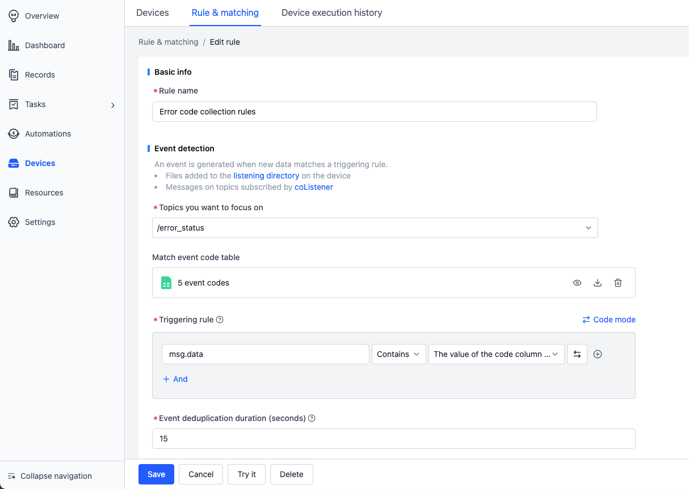

# Set Up Your Data Collection
Use the following scenario as an example to quickly get started with the automatic data collection workflow:

- When a newly generated `.mcap` file on the device contains the topic `/error_status`, and the `data` field of that topic includes event codes `1001 ~ 1005`, data from 5 minutes before to 1 minute after the timestamp will be automatically collected and saved to a record. Example message:

  

## Prerequisites
1. Prepare a Linux device.
2. Create a project named `auto-upload`.
3. Make sure your role is “Organization Admin”. If not, contact your organization admin to update your role.

   

## Device Configuration
1. Go to the Organization Management > Devices > Device Configuration page and configure global rule-based data collection settings.

   

2. Assuming the bag file directory on the device is `/home/bag` and the topic to monitor is `/error_status`, configure it as follows:

   ```yaml
   mod:
   # mod name, default is 'default'
   name: 'default'
   conf:
      # Enable status, default is true
      enabled: true

      # (For rule-based collection) Directory to listen to on the device
      listen_dirs: 
         - /home/bag/

      # (For manual and rule-based collection) Directory to collect from
      collect_dirs: 
         - /home/bag/
         
   # (For rule-based collection) Topics available for trigger matching
   topics:
   - /error_status
   ```

   For more configuration options, see [Device Configuration Format](../../device/4-device-collector.md).

## Create Rule
1. Enter the auto-upload project

   

2. Go to Devices > Rules & matching page and create a rule from a template.

   

3. Choose the error code collection rule and download the sample .mcap file.

   

4. View and save the rule:

   

   - **Event detection**
      - Topic to monitor: /error_status
      - Error code list: Upload a CSV/JSON file formatted with a code column, like:

         

      - Trigger condition: mag.data contains any value from the code column

      This means: monitor topic /error_status, and check whether the data field contains keywords 1001 ~ 1005

   - **Data collection**
      - Time Range: 
         - Collect files from `collect_dirs` 5 minutes before and 1 minute after the trigger timestamp
         - Time is determined based on file content
      - Record: Used to identify where the data from each collection will be saved.
         - Example: `code: {scope.code}-name: {scope.name}`. If event code `1002` is triggered, the record will be named: `code:1002-name:	Target unreachable! Please assist`
   - **Key moment identification**
      - After data is uploaded to the record, a "Moment" will be created at the trigger time for later analysis.

5. Enable the rule
   Only after enabling the rule will devices in the project begin monitoring based on the rule.

   

   *See more rule condition examples in [Rules](./3-add-rule.md)

## Add Device to Project
1. Create the monitoring and collection directory `/home/bag` on the device:

   ```
   cd /home
   mkdir bag
   ```

2. Go to Project > Devices page to get the device installation command.

   

3. Run the installation command on the device:

   

4. After installation, the device will be automatically added to the project. Go to Organization Management > Devices to enable the device, and it will start collecting data automatically based on the rule.

   

## Write File on the Device
1. Confirm the device has received the rule

   - View logs on the device using the following command:

      ```bash
      tail -f ~/.local/state/cos/logs/cos.log
      ```

   - If you see `received rules` in the logs, the rule was received successfully.

      

2. Copy the .mcap file from step 3 of Create Rule to the device directory `/home/bag/`.

3. Automatic .mcap upload:

   - If the logs show the following, it means a rule was triggered:

      

   - If the logs show uploaded, the .mcap file was successfully uploaded.

      

## View Created Records
1. Enter the project and view the automatically created records:

   

2. View the data uploaded to the record:

   

3. View the Moment created at the trigger time:

   

## Learn More

- [Add a Rule](./3-add-rule.md)
- [Visualize and Replay Data](../../viz/1-about-viz.md)
