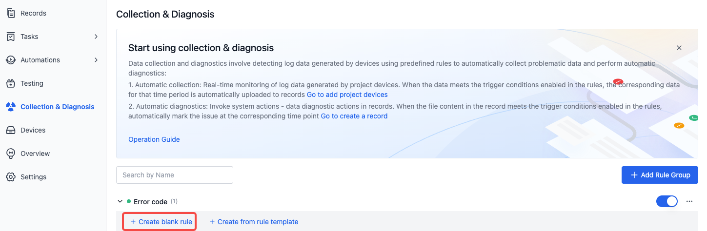
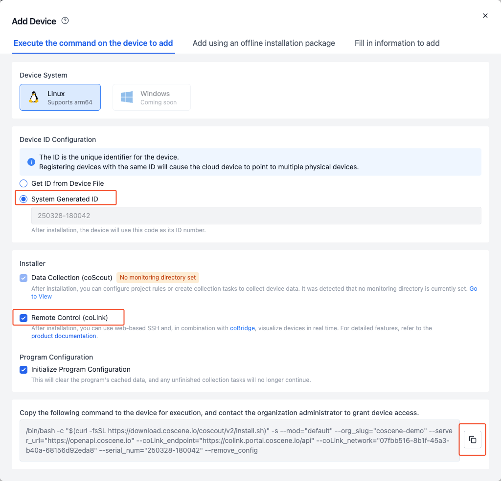
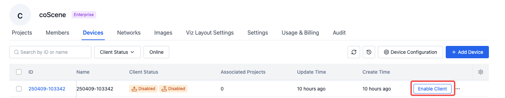
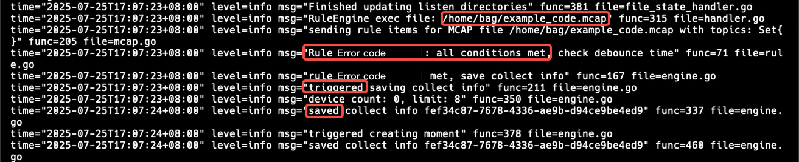

# Set Up Your Data Collection

Using the following scenario as an example, let's setup your automatic data collection and diagnosis.

- When "error 1" phrase appears in the log of the device 'dev-A', the log file will be uploaded and create a record. Additionaly, a moment will be created at the exact time this phrase happened.

## Prerequisites

1. Have a device ready.
2. Create a project named `auto-upload`.
3. Make sure your role in the coScene organization is "Administrator". If you're not an administrator, contact your organizational admin to update your role.
   

## Adding Rules to Your Project

1. Navigate to the `auto-upload` project
   

2. Within the project, go to the "Collection & Diagnosis" page and click "Add Rule Group"
   

3. After changing the rule group name, click "Create Blank Rule"
   

4. Change the rule name, select `/external_log` as the topic, enter "msg.message contains error 1" as the event matching condition, check both "Collect Data" and "Diagnose Data" in trigger actions, change the moment name to "Triggered error 1", and click "Create"

   
   

5. Return to the "Data Collection & Diagnosis Rules" page, select the rule group you just added, and click the enable button
   

   \*For more rule condition styles, see [Rule Groups](./3-add-rule.md#rule-group)

## Adding Data Diagnosis Trigger in Project

1. Navigate to the `auto-upload` project
   

2. In the project, go to "Automation - Triggers" page and click "Create Trigger"
   

3. Edit trigger content:

- Edit trigger name as "Auto Diagnosis"
- Select "System Action" as the associated action
- Choose "Data Diagnosis" from the system action dropdown
- Edit file wildcard pattern as `**/*` (using Glob format, see [reference documentation](https://www.malikbrowne.com/blog/a-beginners-guide-glob-patterns/))
- Click "Create Trigger"

  

## Configure Data Collection Device Information

1. Go to the "Devices" tab on the organization management page, and click the "Device Configuration" button.

   

2. Clear the default content in the rules, then copy and paste the following rule into the editor:

   ```yaml
   mod:
     name: 'default' # mod name, default is "default". For custom versions, please contact coScene product for more details.
     conf:
       enabled: true # Whether to enable, default is true.

       # Monitored directories on the device, specified for data collection tasks and rule collection in the project
       collect_dirs:
         - /root/logs
       listen_dirs:
         - /root/logs
       skip_period_hours: 2
   collector:
     delete_after_interval_in_hours: 48
   updater:
     enabled: false
   ```

3. Click the "Save Changes" button.

<br />

## Authorizing Device

> Using a Linux device as an example, for other device registration methods refer to [Device Registration](../../device/2-create-device.md)

<br />

1. Open the device terminal, execute the following command, enter the password to switch to root.

   ```
   sudo su
   ```

2. In terminal, create folders to be monitored `/root/logs`

   ```
   mkdir logs
   ```

3. In coScene Web, enter the Device tab in the Org management page

   

4. Copy the installation command, and paste it to the terminal input as Root user

   

5. Run the script, and checkout the system logs

   ```
    tail -f ~/.local/state/cos/logs/cos.log
   ```

   - when you see the following logs, the installation is completed and wait to be permitted by the admins

     

6. In the device page of the Org settings page, find the to be permitted device, and click "Enable Client"

   

<br />

## Adding Device to Project

1. In the project's "Project Devices" tab, click "Add Device"
   

2. Select the device(s) you want to add and click "Confirm"

## Write Files in the Device Monitoring Directory

1. Ensure the device has received the data collection and diagnostic rules:

   - When the following entry appears in the logs, it indicates that the rules have been successfully acquired:

     

2. <a href="https://coscene-artifacts-prod.oss-cn-hangzhou.aliyuncs.com/docs/4-recipes/data-diagnosis/dev-A.log.zip" download>Click to download</a> the `dev-A.log` generated by device dev-A. Its contents are as follows:

   ```
   2023-09-01 11:28:47.000 INFO "Demo Log message 1"
   2023-09-01 11:28:48.000 INFO "Demo Log message 2"
   2023-09-01 11:28:49.000 INFO "Demo Log message 3"
   2023-09-01 11:28:50.000 WARN "Demo Log message 4"
   2023-09-01 11:28:51.000 INFO "Demo Log message 5"
   2023-09-01 11:28:52.000 INFO "Demo Log message 6"
   2023-09-01 11:28:53.000 INFO "Demo Log message 7"
   2023-09-01 11:28:54.000 INFO "Demo Log message 8"
   2023-09-01 11:28:55.000 INFO "Demo Log message 9"
   2023-09-01 11:28:56.000 INFO "Demo Log message 10"
   2023-09-01 11:28:57.000 WARN "Demo Log message 11"
   2023-09-01 11:28:58.000 ERROR "Demo Log message 12 error 1"
   2023-09-01 11:28:59.000 INFO "Demo Log message 13"
   2023-09-01 11:29:00.000 INFO "Demo Log message 14"
   2023-09-01 11:29:01.000 INFO "Demo Log message 15"
   2023-09-01 11:29:02.000 INFO "Demo Log message 16"
   2023-09-01 11:29:03.000 INFO "Demo Log message 17"
   2023-09-01 11:29:04.000 INFO "Demo Log message 18"
   2023-09-01 11:29:05.000 INFO "Demo Log message 19"
   2023-09-01 11:29:06.000 INFO "Demo Log message 20"
   ```

3. In your terminal, execute the command to copy the file dev-A.log to the /root/logs/ directory on the device.

   ```
   scp Downloads/dev-A.log root@ubuntu:/root/logs

   # Where Downloads/dev-A.log is the directory where the dev-A.log file is located on the local machine, and root@ubuntu is the device name. Both need to be modified accordingly.
   ```

4. Log Data Upload

   - When the following entry appears in the logs, it indicates that the log data is being uploaded to the coScene platform.

     

<br />

## View the Created Record

1. Enter the `auto-upload` project.

   

2. View the automatically created record, and check the data uploaded in the record.

   
