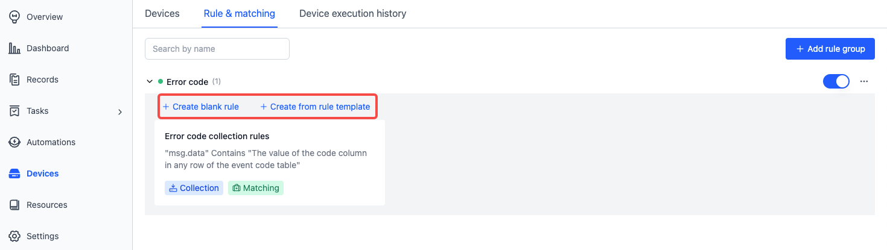
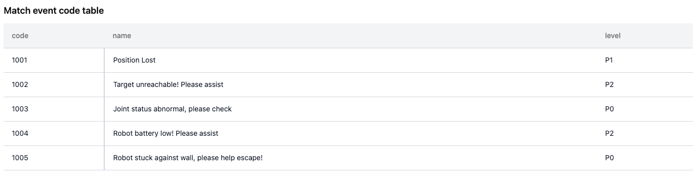
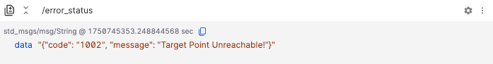
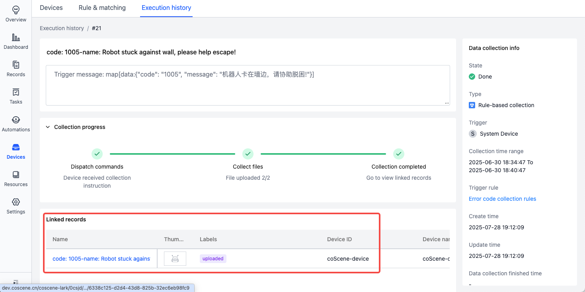

# Add Rule

> **Permissions**: Only **Project Admins** and **Organization Admins** can manage rules. Other roles can only view rule content.

On the "Rules & matching" page of project devices, you can add rules to automatically monitor and collect data from project devices.

## Specific Data Format

Platform rules only apply to data in specific formats, which must include message, timestamp, topic, and message type, and belong to streaming data.

The supported timestamp formats for log text files are as follows:

| Timestamp Type                                                                                                                                              | Timestamp Format     | Example                    |
| ----------------------------------------------------------------------------------------------------------------------------------------------------------- | -------------------- | -------------------------- |
| Regular file timestamp                                                                                                                                      | %m%d %H:%M:%S.%f     | 0212 12:12:12.548513       |
|                                                                                                                                                             | %b %d %H:%M:%S       | Dec 12 12:12:12            |
|                                                                                                                                                             | %Y-%m-%d %H:%M:%S.%f | 2023-02-12 12:12:12.548513 |
|                                                                                                                                                             | %H:%M:%S.%f          | 12:12:12.548513            |
| Special _filename / first line of the file's timestamp_ (for cases where the year, month, day, hour, minute, and second are not fully included in the file) | %Y-%m-%d %H:%M:%S    | 2023-02-12 12:12:12        |
|                                                                                                                                                             | %Y/%m/%d %H:%M:%S    | 2023/02/12 12:12:12        |
|                                                                                                                                                             | %Y%m%d%H             | 2023021212                 |

If there are other timestamp formats that need to be supported, please contact us.

## Adding Rules

A rule group is a collection of rules used to categorize and manage rules. Rules define the conditions to trigger data collection and the subsequent actions.

Navigate to the "Device - Rules & matching" page and click **Add rule group**:


Inside a rule group, you can click **Create blank rule** or **Create from rule template** to add a new rule:



Rules consist of **Basic info**, **Event detection**, and **Trigger action**:


## Event Detection

Monitor newly generated files/data. If the content matches the event condition, an event is triggered and reported. Handled content includes:

- Files in the device's `listen_dirs`, see [Device Configuration](../../device/4-device-collector.md)
- Messages from a specific device-side topic
  - Requires installation and activation of the ROS suite, see [Add Device](../../device/2-create-device.md)

- Files within a record
  - Requires using the **Data matching** action within the record to detect events


### Monitored Topics

> It’s recommended to publish all device error codes to a single topic like `/error_code` for standardized error code collection.

The system provides two default topics:

- `/error_status`: For use with the **Error code collection rule** template, see [Get Started with Rule Collection](./2-get-started.md)
- `/external_log`: For handling `.log` files that meet certain conditions

To configure more options, click **View device configuration** to go to the [Device Configuration](../../device/4-device-collector.md) page.


### Match Event Code Table

The event code table defines event `code`, name, severity, and resolution, used for displaying event info in Moments and Records.




- The code table **must contain a `code` column** as the event's unique identifier. Other columns are optional.

- After uploading the table (supports JSON or CSV), you can preview, download, or delete it.
  - To modify, download the original, delete it from the rule, and upload the modified file.

### Rule Trigger Conditions

Conditions are based on whether certain device message fields match specific values.

Assume topic `/error_status` with message type `std_msgs/String`, for example:



- To detect if `data` contains any value from the event code table:
  - Input: `msg.data contains the value of the code column`

  

- To detect if `data` equals a specific code `1001`:
  - Switch to fixed value input
  - Input: `msg.data equals 1001`

  

- If `data` is an array and needs to check for any match with the code column:
  - Switch to code mode
  - Input: `msg.data.exists(x, x.code.contains(scope.code))`

  
  

- To detect if a log contains keyword `error 1`:
  - Input: `msg.message contains error 1` and select `/external_log` as the monitored topic

  

### Event Deduplication Duration

If a new event (of the same type) occurs within a set time since the last event merge, it will be merged. The timer resets with each new occurrence, and final merge completes after no further events occur within the window.

- Supported range: 1 to 86400 seconds (1 day)


## Trigger Actions

Triggered actions are executed when rule conditions are met. Includes **Data collection** and **Key moment identification**.

### Data Collection

Once a rule is triggered, the device automatically collects relevant data and uploads it to the record.

This module defines: file time range, record info, collection limits, and more settings.


- **Upload Time Range**
  - Defines how much time before and after the trigger time to collect files.

- **Record Info**
  - Set record name, description, and labels. Name/description can use variables (e.g., `{scope.code}`, see below).
  - The tag `uploaded` is automatically added once data is uploaded.

- **Collection Limits**
  - Define max number of uploads per day per device or across all devices for repeated events.
  - Recommended to set limits to avoid excessive uploads.

- **More Settings**
  - File Filtering:
    - By default, all files in the data directory during the time window are uploaded.
    - Use [glob pattern](https://www.malikbrowne.com/blog/a-beginners-guide-glob-patterns/) to whitelist specific files.

  - Additional Files:
    - Specify absolute paths of extra files/folder to upload (e.g., maps, config files).

Data collection example:


Data auto-uploaded to record example:



### Key moment identification

After rule is triggered, a **Moment** is automatically created in the record to mark a critical time point.

- After collecting data into a record, a Moment is created at the trigger timestamp.
- For manually created records, invoking the **Data matching** action will match against rules marked with **Key moment identification**.

This module defines: Moment Info and Task Info


- **Moment Info**
  - Define name, description, and attributes of the moment. Supports variables (e.g., `{scope.code}`).

- **Task Info**
  - Configure task creation, assignee, and [syncing to ticket systems](../../3-collaboration/integration/1-jira-integration.md).

Auto-created moment example:


## Rule Variables

You can use variables/expressions in rule actions to reference values at the time of the trigger.

Example:

- Event Code Table:

  

- The triggered event is a message from the `/error_status` topic:

  ```
  {
    "code": "1001",
    "message": "Positioning lost",
    "label": ["Positioning issue","Version:v1.0","Other tags"],
    "files": ["/home/coscene/20250808_1.bag","/home/coscene/20250808_2.bag"]
  }
  ```

Variable reference table:

| Variable                                                          | Meaning                                                               | Example                                                                         |
| ----------------------------------------------------------------- | --------------------------------------------------------------------- | ------------------------------------------------------------------------------- |
| `{scope.code}`                                                    | The `code` of the event from the event code table                     | `1001`                                                                          |
| `{scope.name}`                                                    | The `name` of the corresponding event                                 | `Positioning lost`                                                              |
| `{msg}`                                                           | The message content that triggered the rule                           | `{msg}` represents the entire message content                                   |
| `{msg.label}`                                                     | The value of the `label` field in the message that triggered the rule | `{msg.label}` = `"Positioning issue","Version:v1.0","Other tags"`               |
| `{msg.files}`                                                     | The value of the `files` field in the message that triggered the rule | `{msg.files}` = `"/home/coscene/20250808_1.bag","/home/coscene/20250808_2.bag"` |
| `{topic}`                                                         | The triggered topic                                                   | `/error_status`                                                                 |
| `{ts}`                                                            | The trigger timestamp                                                 | `1751436062.133`                                                                |
| `{timestamp(ts).format("%Y-%m-%d %H:%M:%S", "America/New_York")}` | Format timestamp to New York time                                     | `2025-07-02 02:01:02`                                                           |

**Note:**

- When used in rule **conditions**, write the variable directly (no `{}`).
- When used in **non-conditions**, like record name/description, use `{}`.
- Expressions follow [CEL syntax](https://github.com/google/cel-spec/blob/master/doc/langdef.md).

Example usage of rule variables:

1. **Record Name**
   - Input: Error Code:`{scope.code} @ {timestamp(ts).format("%Y-%m-%d %H:%M:%S", "Asia/Shanghai")}`
   - Output: Error Code:1001 @ 2025-07-02 14:01:02

2. **Record Description**
   - Input: `{msg.message}`
   - Output: Positioning lost

3. **Record label**
   - Input: `{msg.label}`
     - If the message field type is an array/single string, its content can be automatically parsed as record label
   - Output: Positioning issue, Version:v1.0, Other tags

4. **More Settings – Specific Attached Files**
   - Input: `{msg.files}`
     - If the message field type is an array, the file list inside it can be automatically parsed as attached files for upload
     - If you only need to upload the file list defined in the message `{msg.files}`, there is no need to configure the collection path `collect_dirs` in Organization → Device → Device Configuration
   - Output: /home/coscene/20250808_1.bag, /home/coscene/20250808_2.bag

5. **Moment Name**
   - Input: `{scope.code}-{scope.name}`
   - Output: 1001-Positioning Lost

6. **Moment Attributes**
   - Input:
     - Attribute Name Input: Error Level
     - Attribute Value Input: `{scope.level}`
   - Output:
     - Attribute Name: Error Level
     - Attribute Value: P1

### Custom Functions

In addition to [CEL syntax](https://github.com/google/cel-spec/blob/master/doc/langdef.md), the following functions are also supported:

- **timestamp** – Convert various types to timestamp
  - Signature:
    - `timestamp(double) -> google.protobuf.Timestamp`

  - Example:

    ```cel
    timestamp(1738915780.123) -> timestamp("2025-02-07T08:09:40.123")
    ```

- **format** – Format timestamp as a string
  - Signature:
    - `google.protobuf.Timestamp.format(string) -> string`
    - `google.protobuf.Timestamp.format(string, string) -> string`
    - `google.protobuf.Timestamp.format(string, int) -> string`

  - Example:

    ```cel
    timestamp("2025-02-07T08:09:40.123").format("%Y-%m-%d %H:%M:%S") -> "UTC: 2025-02-07 08:09:40"
    timestamp("2025-02-07T08:09:40.123").format("%Y-%m-%d %H:%M:%S", "America/New_York") -> "2025-02-07 04:09:40"
    timestamp("2025-02-07T08:09:40.123").format("%Y-%m-%d %H:%M:%S", 8*60*60) -> "2025-02-07 16:09:40"
    ```

**Note:**

- Timestamp format strings follow `man 3 strftime` ([learn more](https://linux.die.net/man/3/strftime))
- Timezones support [IANA standard names](https://en.wikipedia.org/wiki/List_of_tz_database_time_zones)

## Next Steps

- [Debug and Enable Rules](./4-manage-rule-group.md)
- [Add Device](../../device/2-create-device.md)
