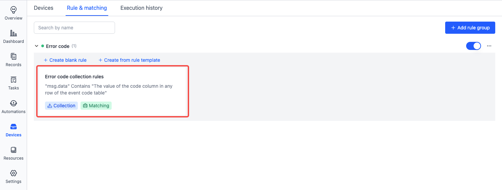
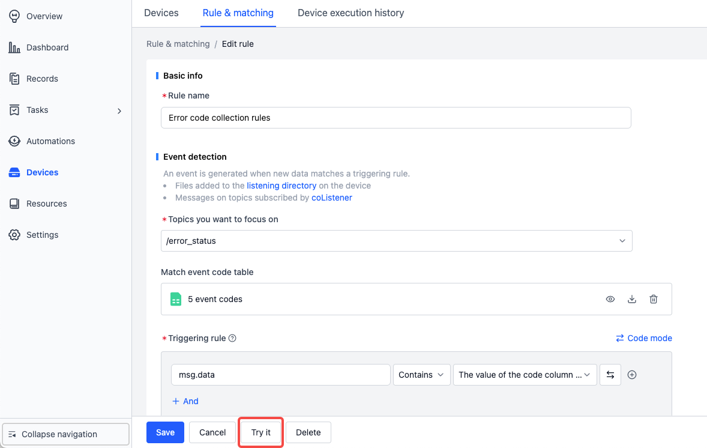
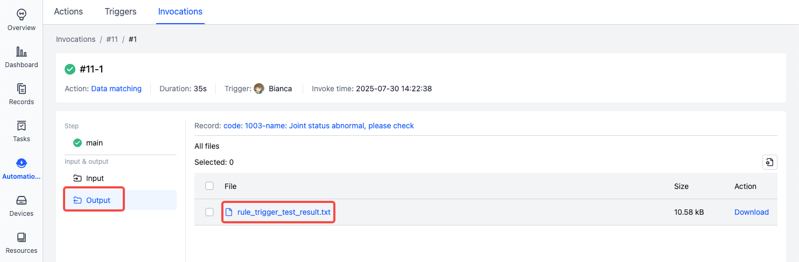
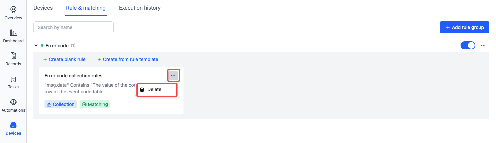
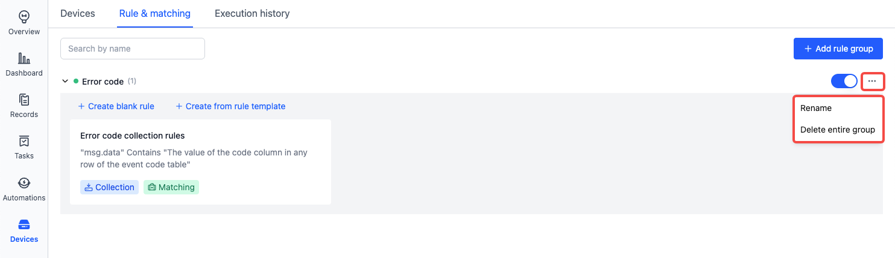

# Managing Rule

## Enable

Before using a rule group, it needs to be enabled. Once a rule group is enabled, the rules within the group will then become active.
If the rules in the rule group are temporarily not needed in certain scenarios, the rule group can also be disabled.

An enabled rule group will be shown in blue in the rule group status list, while a disabled rule group will appear grayed out.

To enable/disable a rule group:

- Go to the "Device - Rules & matching" page, select the rule group, and toggle the corresponding **[Status]** button.

## Edit

To access the rule group editing page, follow the steps shown in the image below. For details on how to edit rules within the group, refer to [Rules](./3-add-rule.md).

- Go to the "Device - Rules & matching" page, select the rule you want to edit, and click the rule name.

 

## Debug
> Prerequisite: Prepare a record that contains files suitable for debugging—such as mcap, bag, or log files that can trigger the rule.

1. In the rule details view, click the **Try it** button and select the prepared record.

    

2. View the debug logs.

    

3. In the "Output" section of the debug logs, inspect the debug file.

    

## Delete

If the rules within a rule group are no longer needed, the rule group can be deleted.

Here are the steps to delete a rule group:

- Go to the "Device - Rules & matching" page, select the rule to be deleted, click the corresponding `...` button on the right, and choose **[Delete]**.
- In the popup, select **[OK]**.

In **More actions**, you can rename or delete the rule group.

