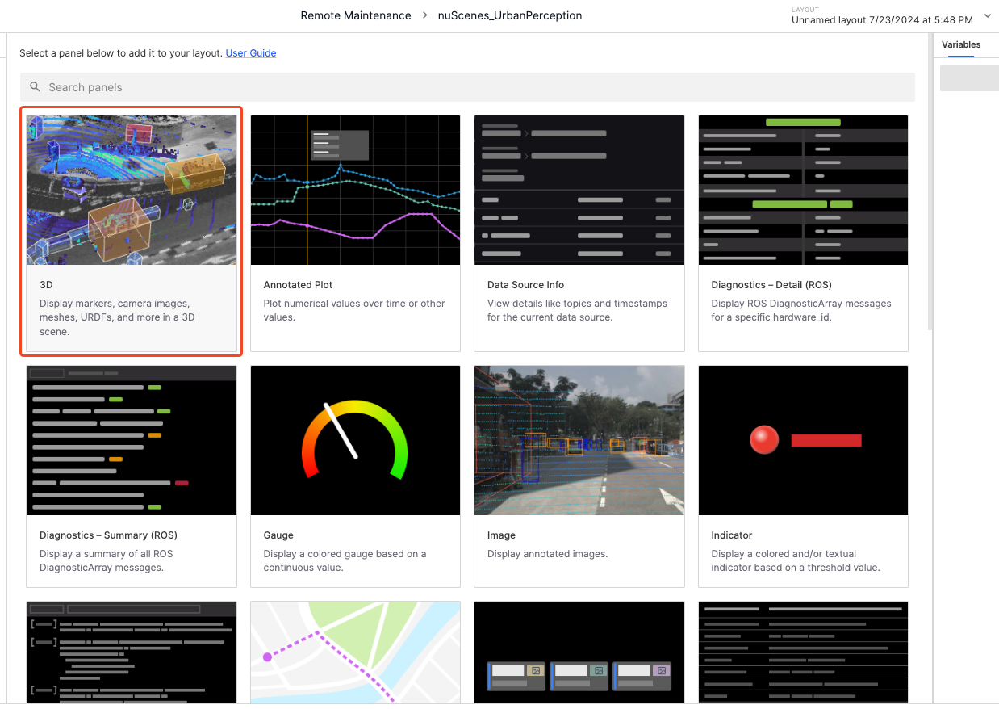
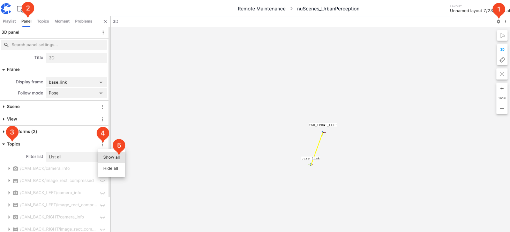
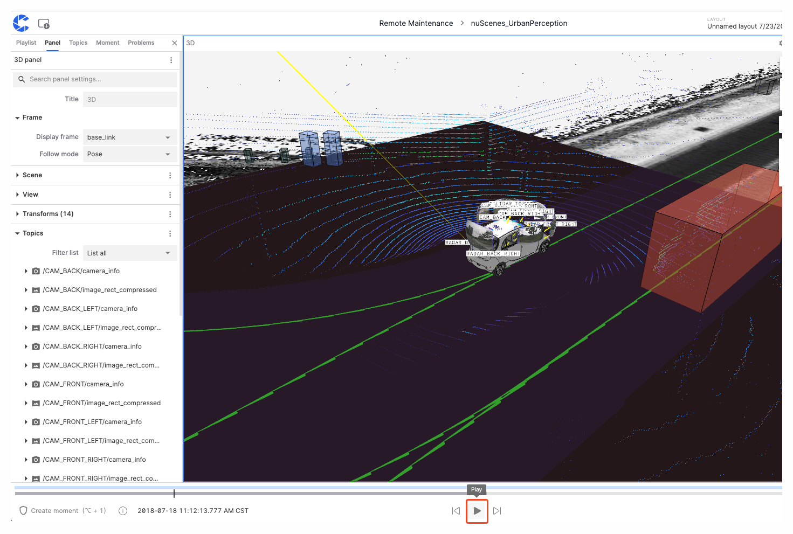

# Visualize Your Data Using the 3D Panel

This section will demonstrate the steps to visualize data using coScene's 3D panel with the "scene-0001.mcap" file as an example.

## Prerequisites
1. Browser: Chrome 104 or later version. Please visit [Chrome Official Website](https://www.google.com/chrome/) to get the latest version
2. Create a record in your project and upload bag/mcap files, then play the record. See [Create Record](../collaboration/record/2-create-record.md) and [Upload Files](../collaboration/record/4-upload-files.md) for details.

## Visualizing Data
### Add a 3D Panel

1. In the visualization page, select **Create Empty Layout** from the **Layout Menu**.

   

2. Select the **3D** panel to add it to your layout.

   

### Expand Topics

1. Click the **Settings** button in the **Panel Top Bar** to enter the panel properties page in the left sidebar.
2. Click the **Show All** button next to **Topics** to display all topics.

   

### Play

Click the **Play** button on the **Timeline** to start playing the data.

## Learn More
- [3D Panel Features](./4-panel/2-3d-panel.md)
- [Import Maps and Static TF](../collaboration/record/5-manage-file.md)

## FAQ
1. **Q: After clicking play record, it redirects to a blank page/no content is displayed**

    A: Please check if your browser is Chrome 104 or a later version; please disable all browser plugins. If the issue persists after updating the browser and disabling plugins, please contact coScene technical support.

2. **Q: Custom topics are not displaying correctly when playing the record**
    A: Only standard format topics are supported for playback. For custom topics, please use the "Raw Messages" panel to view them.

---
