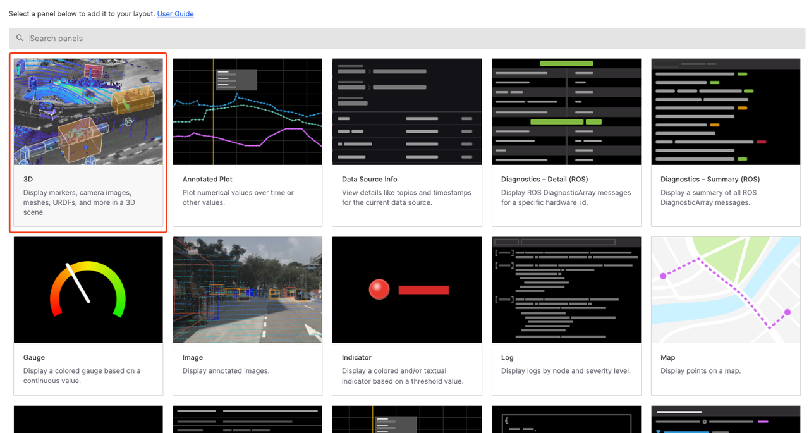
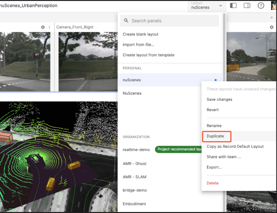
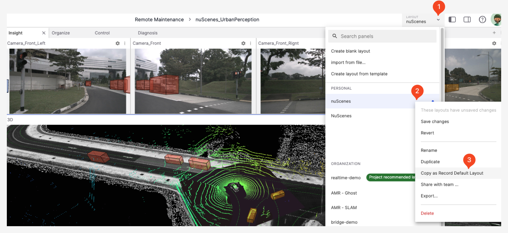

# Layout

"Layout" refers to the arrangement of elements in the visualization interface, which can be shared with project and organization members.

## Creating a Layout

Click the **Layout Menu** to create a layout through the following methods: **Create Blank Layout**, **Copy Existing Layout**, or **Import Layout from File**.

### Create Blank Layout

Click the **Create Blank Layout** button in the Layout Menu to enter the following page, then select a desired panel.

### Copy Layout Creation

1. For a preferred layout existing in the organization, right-click and select **Create Personal Copy** from the popup menu to add the layout to personal layouts.

    

2. Similarly, right-click **Duplicate** in personal layouts to create a copy of the layout.

    

### Import Layout

Import a local layout file into personal layouts through **Import from File** in the Layout Menu.

## Recommended Layouts

"Recommended Layouts" are preset and suggested layout types, including **Organization Recommended Layouts** and **Project Recommended Layouts**.

### Organization Recommended
> Only organization administrators can configure

Newly created projects will automatically use the "Organization Recommended Layout" as the "Project Recommended Layout". When project members play a record without any available layouts, the project layout will be used by default.

You can access **Layout Configuration** in **Organization Management** from the avatar menu to select the recommended layout for your organization.

### Project Recommended
> Only project administrators and higher roles can configure

When project members play a record without any available layouts, the project layout will be used by default.

You can access **Layout Configuration** in **Project Settings** to select the recommended layout for your project.

### Record Recommended
The "Record Recommended Layout" is the default layout for a record. When any user plays this record, this layout will be used.

In the visualization page, right-click the layout you want to set in the **Layout Menu** and click "Copy as Record Default Layout".

As shown in the figure, the layout "NuScenes" has been successfully set as the record recommended layout. Entering the visualization interface of the record will then use this layout by default.

## Layout Priority
For records with all three recommended layouts set, the priority is **Record Recommended Layout** > **Project Recommended Layout** > **Organization Recommended Layout**.

## Managing Layouts
Click the **Actions** icon next to the layout name to manage the layout, including: save changes, revert, rename, copy, share, export, delete, etc.

### Rename

Change the name of the layout for better identification and categorization.

### Export

Save the layout as a file for sharing or use in other environments.

### Share with Team

Share the layout with the team, allowing organization members to use and modify shared layout copies.

### Delete

Remove layouts that are no longer needed to keep the layout list clean and efficient.

---
