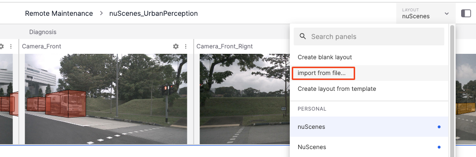
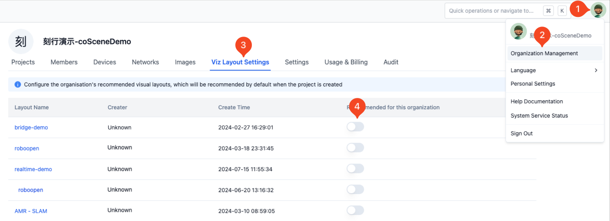
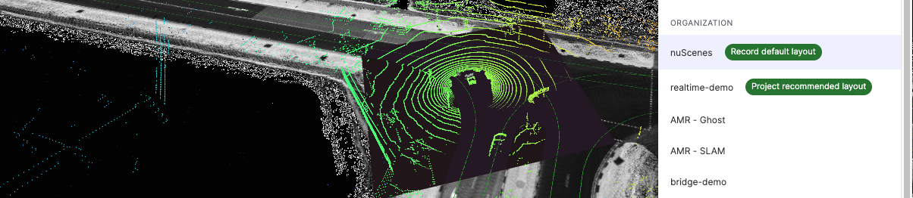

# Layout

"Layout" is the way to arrange elements in a visual interface. It can be shared with project members, helping to present device data in an intuitive visual manner, enabling users to efficiently view and analyze various types of multimodal data.

## Create a layout

Click on **Layout** in the upper - right corner of the visual interface to enter the layout management page. You can create a layout in the following ways: **Create blank layout**, **Copy from other project**, or **Import from file**.

### Create blank layout

1. Fill in the new layout name, type (Personal layout or Project layout), and the optional folder for storing the layout.

2. After confirmation, enter the new layout configuration page. You can directly select the panels you are interested in from the page, or click the "Add Panel" button in the upper - right corner to select more panels.

    

:::info
🤖 If you want to use more panels in a layout, use the **Tab** panel function. Hold down Shift and click multiple panels, then select **Group by Tabs**, and you can organize them immediately without manual dragging.
:::

3. After the configuration is completed
 - You can click the **Save** button at the top to save the layout permanently.
 - If you do not click to save the changes, they will be stored in the cache of the current browser for use in the next data visualization.
 - Click the **Revert** button, and the layout will return to its last saved state.
   
    

### Copy from other project

By copying the layout of an existing project, you can quickly obtain a basic layout framework that meets some of your requirements. Then, you can modify and adjust it based on this framework, which greatly saves the time of layout design and improves work efficiency.

    

### Import from file

You will be prompted to select a layout json file from the file system of your current computer for import.

## Layout use cases

### Personal layout

Only you can access your personal layout - no one else can view, load, or edit it.

Changes to your personal layout will be synced to all your computers and can be copied as a project layout for sharing.

### Project layout

Project layouts provide a way for teams to organize a set of standardized layouts for common data visualization within the project.

When a project is made public, the project layouts will also be made public so that visitors can use suitable layouts when browsing the visualized data.

## Manage layouts

You can directly browse the layout folders on the left side. They are divided into: All, Personal, and Project.

### Use layout

In the layout management section, find the layout you want to use and click the **Use Layout** button in front of the layout name to switch to the corresponding layout.

:::info
🤖 The system will remember the layout you last used in the current project. The next time you perform a visualization operation, it will default to using the last - used layout.
:::

### Rename

Modify the name of the layout for better identification and classification.

### Copy

Copy the layout as a personal/current project layout.

### Move to folder

Move the layout to other folders within the current category (personal/project).

### Export

Export the layout as a json file for sharing or use in other environments.

### Delete

Delete layouts that are no longer needed to keep the layout list clean and efficient.

:::info
🤖 If you delete a project layout, users who can access this project will no longer be able to use this layout.
:::

---
