# 3D Panel

The "3D Panel" is a panel that displays markers, entities, camera images, meshes, URDF models, etc., in a 3D scene. This panel provides a rich visual and interactive experience, allowing for intuitive display and manipulation of 3D objects.

## Properties in the 3D Panel

Click the "3D Panel" and then click the **Panel** button in the left sidebar. The "3D Panel" interface includes: Reference Frames, Scene, View, Transform, Topics, Custom Layers, and Publish Properties.

### Frames

"Frames" are coordinate systems used to define the position and orientation of data and objects in 3D visualization. They provide a common baseline for all elements in the scene, ensuring that various data can be correctly displayed and interacted with in the same space.

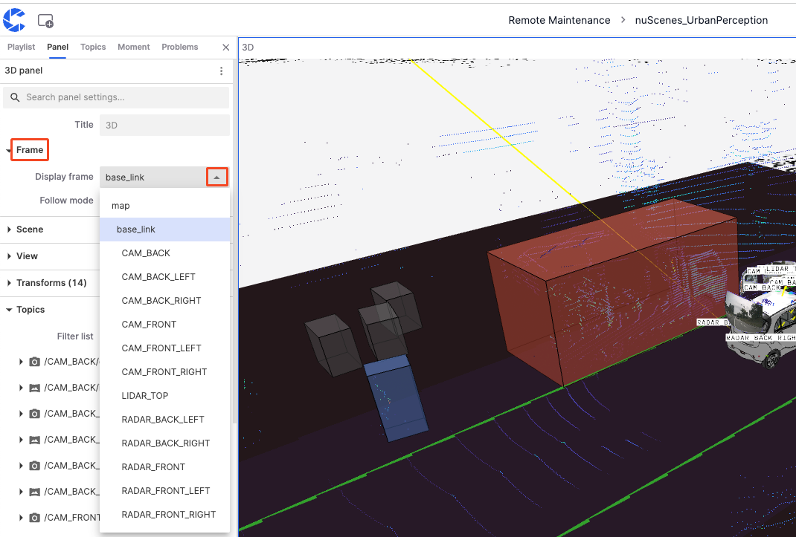

#### Display Frames

1. **map**: Commonly used as the global coordinate system, based on the map, suitable for displaying global positioning data.
2. **base_link**: Reference frame based on the robot or vehicle's center point, usually located at the vehicle's geometric center, suitable for displaying data relative to the vehicle's position and movement.
3. **CAM**: Camera data from different positions on the vehicle.
4. **LIDAR**: LIDAR data from different positions on the vehicle.

#### Follow Mode

"Follow Mode" defines how the view follows the selected reference frame, including three modes: Attitude, Position, and Fixed.

1. **Pose**: The view follows changes in the reference frame's position and orientation. If the reference frame rotates or moves, the view also rotates and moves accordingly.

    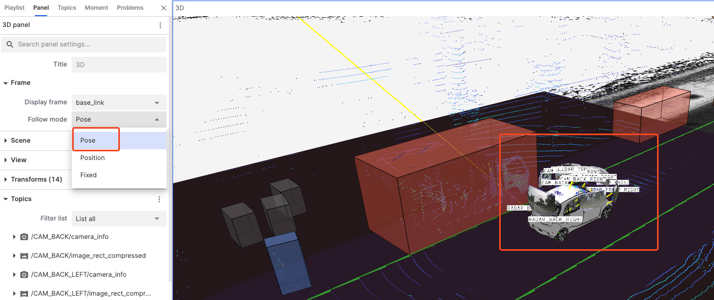

2. **Position**: The view only follows changes in the reference frame's position, not its orientation.

    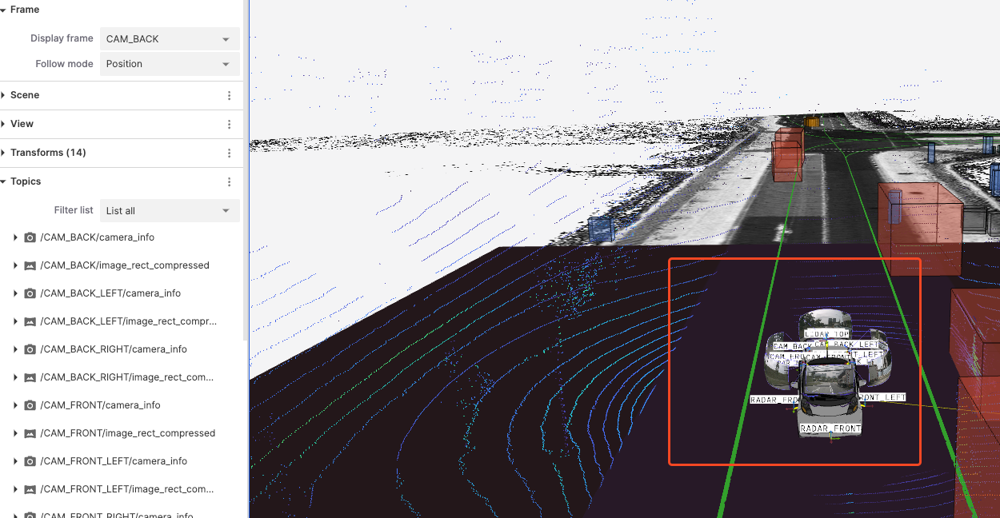

3. **Fixed**: The view does not follow any changes in the reference frame, keeping the perspective fixed.

    

### Scene

The "Scene" is the overall environment in the 3D visualization interface used to configure and display data. It customizes and optimizes the display effect of data by adjusting render statistics, background, label scale, ignore COLLADA, and grid up axis attributes.

- **Render Stats**: Show or hide rendering statistics, enabling this option can display current rendering frame rates and other performance metrics.

    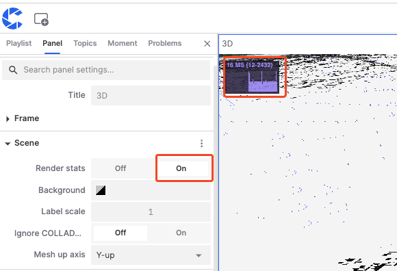

- **Background**: Set the background color of the scene to enhance contrast and visualization effect.

    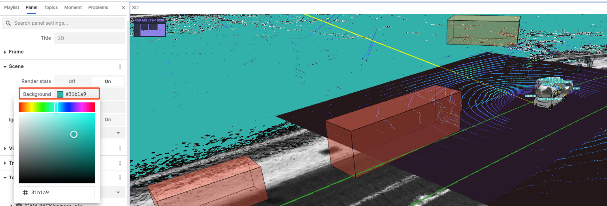

- **Label Scale**: Adjust the scale size of labels displayed in the scene.

    

- **Ignore COLLADA**: Choose whether to ignore the rendering of COLLADA models to speed up rendering or avoid unnecessary model displays.

- **Mesh Up Axis**: Set the up axis direction of the grid in the scene, affecting the coordinate system direction of the entire scene.

    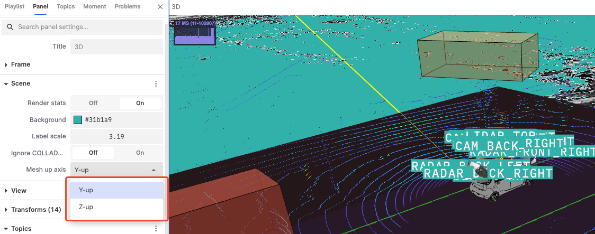

### View

"View" is a functional module in 3D visualization for setting and adjusting camera angles and display parameters. By adjusting different properties in the view, users can achieve better data display effects.

- **Sync Camera**: Synchronize the view with other views, facilitating linked observation of data across multiple views.
- **Distance**: Adjust the distance between the camera and the target object to zoom in or out.
- **Perspective**: Enabling perspective applies a near-large, far-small perspective effect, making the 3D scene more realistic.
- **Target X, Y, Z**: Adjust the target position coordinates of the camera to change its focus position.
- **Theta**: The angle of rotation around the target point to adjust the camera's vertical rotation.
- **Phi**: The horizontal rotation angle around the target point to adjust the camera's left-right rotation.
- **Y-Axis FOV**: Adjust the vertical field of view angle of the camera.
- **Near**: Adjust the nearest visible distance in the camera view.
- **Far**: Adjust the farthest visible distance in the camera view.

### Transforms

"Transforms" is used to adjust the position, rotation, and scaling of objects in 3D space, ensuring they are correctly displayed and operated within the 3D panel.

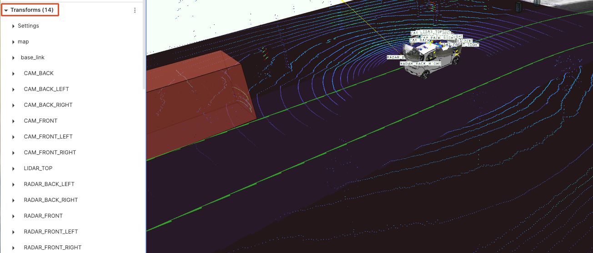

#### Settings

- **Editable**: Control whether to allow editing of transform settings.
- **Labels**: Control whether to display labels.
- **Label Size**: Adjust the size of labels.
- **Axis Scale**: Adjust the scale of axes.
- **Line Width**: Set the width of lines.
- **Line Color**: Choose the color of lines.
- **Enable Preloading**: Control whether to enable preloading to improve display performance.

    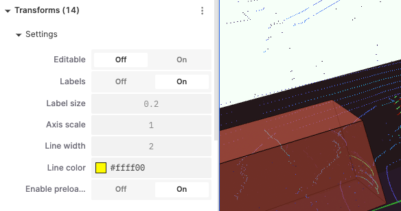

#### Transforms
Displays coordinate transformation information from ROSbag files and external transform data [manually imported](../../collaboration/record/5-manage-file.md) by users.

- **base_link**

    - **Parent Transform**: Set the parent reference frame of the current transform.
    - **Age**: Time interval between the last frame data and current time.
    - **History size**: Number of tf messages in the cache.
    - **Translation (X, Y, Z)**: Adjust the position on the X, Y, Z axes.
    - **Rotation (R, P, Y)**: Adjust the rotation on the roll, pitch, and yaw angles.

        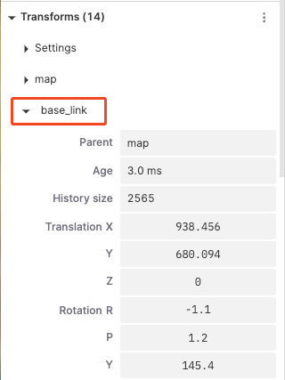

### Topics

"Topics" refer to the categories or channels of data streams. Each topic represents a specific type of data source or sensor data, such as camera images, LIDAR data, annotation information, etc.

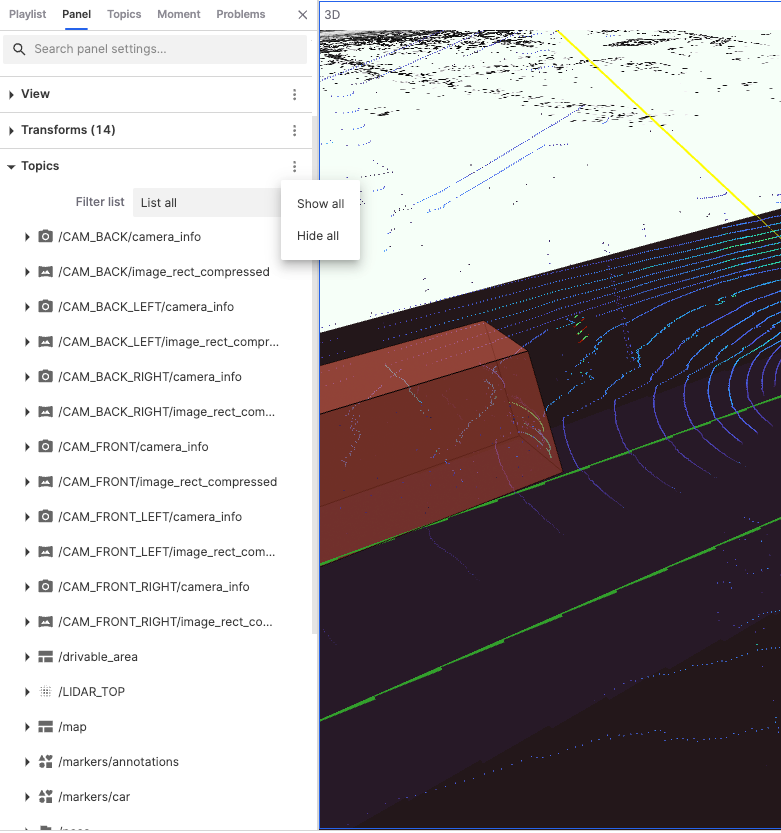

#### Filter List

"Filter List" is used to control and manage the topics displayed on the user interface. Users can list all topics, visible topics, and invisible topics.

#### Topic Classifications and Meanings

- **Camera Data**: Represents calibration information and compressed image data from cameras at different positions. Users can click on camera data topics to adjust their visualization parameters.
  - **Distance**: Set the distance from the camera to the target object.
  - **Plane Projection Factor**: Adjust the projection ratio of the image in the 3D scene, affecting how the image fits onto the plane in the scene.
  - **Line Width**: Adjust the thickness of the image or data boundary lines.
  - **Color**: Adjust the color of the image or data points.

    

- **LIDAR Data**: Represents LIDAR data from different positions, usually displayed as point clouds. Users can click on LIDAR data topics to adjust their visualization parameters.
  - **Point Size**: By increasing or decreasing the size of points, the density and structure of point cloud data can be displayed more clearly. For example, larger points can better display sparse data, while smaller points can better show details.
  - **Point Shape**: Choosing the appropriate point shape can affect the visual effect of the point cloud. For example, circular points may better simulate the actual shape of objects, while square points can better display boundaries.
  - **Decay Time**: Set the duration before point cloud data disappears on the display, helping users observe dynamic changes in the data.
  - **Color Mode**: Choose the coloring mode of point cloud data, allowing the point cloud to be colored based on different data attributes.
  - **Color by**: Select the data dimension or attribute for color mapping, for example, choosing the X-axis will color the point cloud based on its position on the X-axis.
  - **Color Map**: Choose the color palette for point cloud coloring, such as Turbo, Viridis, etc.
  - **Opacity**: Adjust the transparency of point cloud data.
  - **Min and Max Values**: Set the minimum and maximum value range for color mapping.
  - **Stixel View**: A pixel-based stereo vision technology used to display and analyze the stereo structure and depth information of point cloud data.

    

- **Geographic and Location Data**: Represents geographic location, path, and environment information data, usually including drivable areas, global maps, semantic maps, etc.
  - **"drivable_area" and "map" Frame Lock**: Lock the display frame to reduce jitter or instability, ensuring consistent display.
  - **"semantic_map"**:
    - **Show Outlines**: Control whether to display the outlines of data to see data boundaries more clearly.
    - **Selection Variable**: Decide how to display data based on the selected variable.

    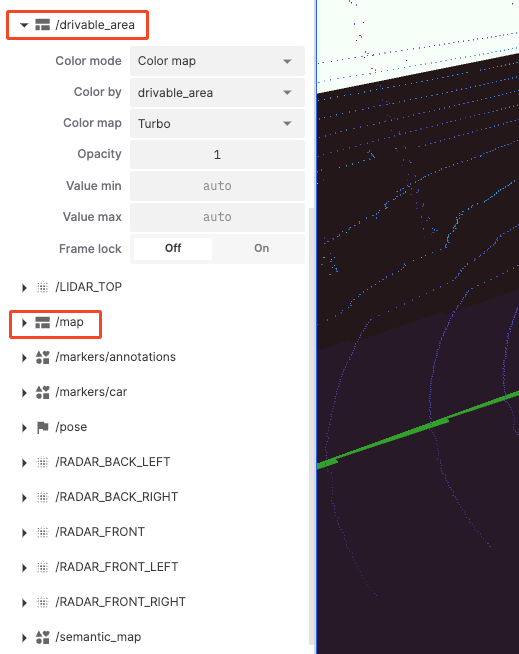

  - **External Map Import**

    When [importing map data](../../collaboration/record/5-manage-file.md) from records, set the color mode of the corresponding map to RGBA to ensure correct display of the map data.

    

- **Markers and Annotations**: Used to add additional information or markers in the visualization scene.
  - **Color**: Set the display color of markers.
  - **Show Outlines**: Choose whether to show surrounding outlines to enhance visual effects.
  - **Selection Variable**: Display data variables.

    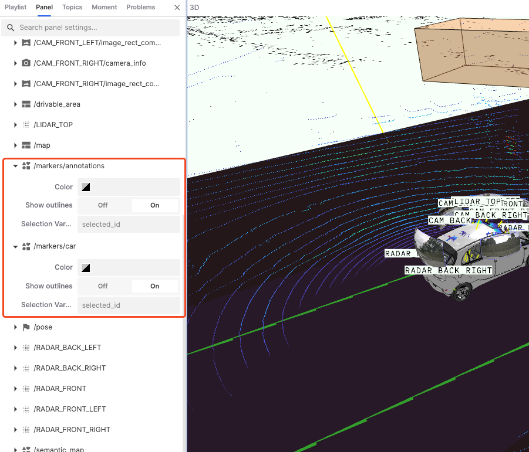

## Tools in the 3D Panel

The right side of the "3D Panel" has a toolbar for controlling and operating the 3D view. From top to bottom, the tools are **Inspect Object**, **Toggle 2D/3D Camera**, **Measuring Tool**, **Recenter**, and **Zoom**.

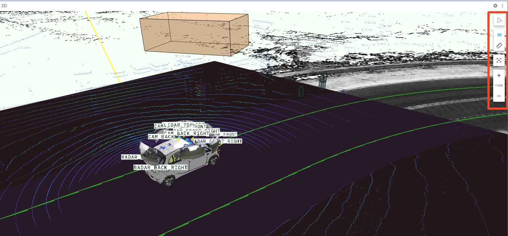

### Inspect Objects

Used to display information about objects in the 3D scene.

1. Click the **Inspect Object** button in the toolbar.

    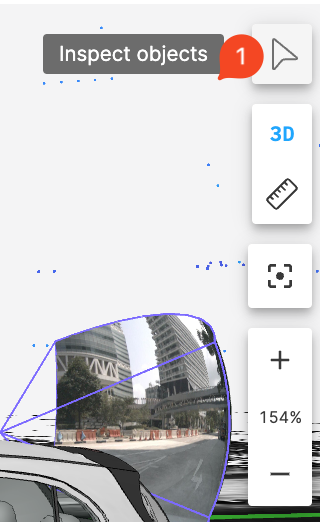

2. Click the object you want to inspect to display the topic and other information about the object.
3. Click the exit button.

    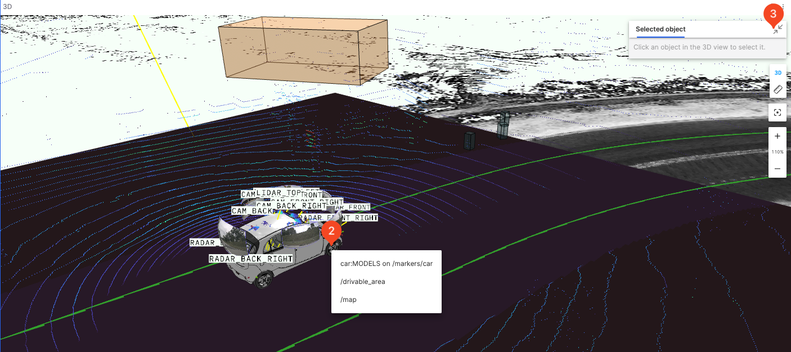

### Toggle 2D/3D Camera

Used to switch the display mode of the 3D scene view. Click the **3D** button in the toolbar to switch between 2D and 3D perspectives.

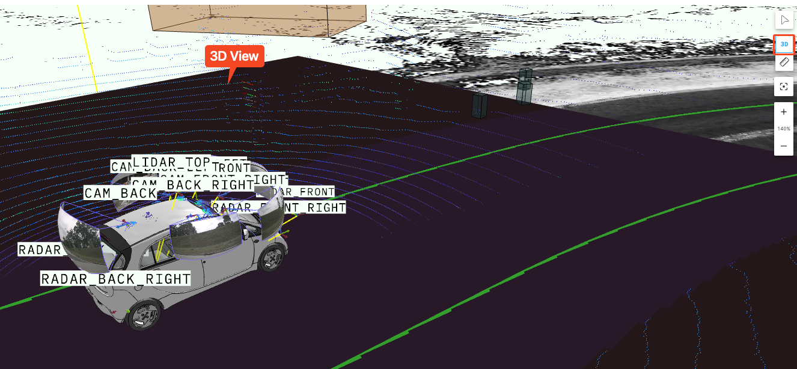

### Measuring Distance

Used to measure the distance between two points in the 3D scene.

1. Click the **Measuring Distance** in the toolbar.
2. Click at the starting point to set the start of the measurement.
3. Click at the endpoint to set the end of the measurement.
4. Click the **Measuring Distance** again to clear the current measurement.

    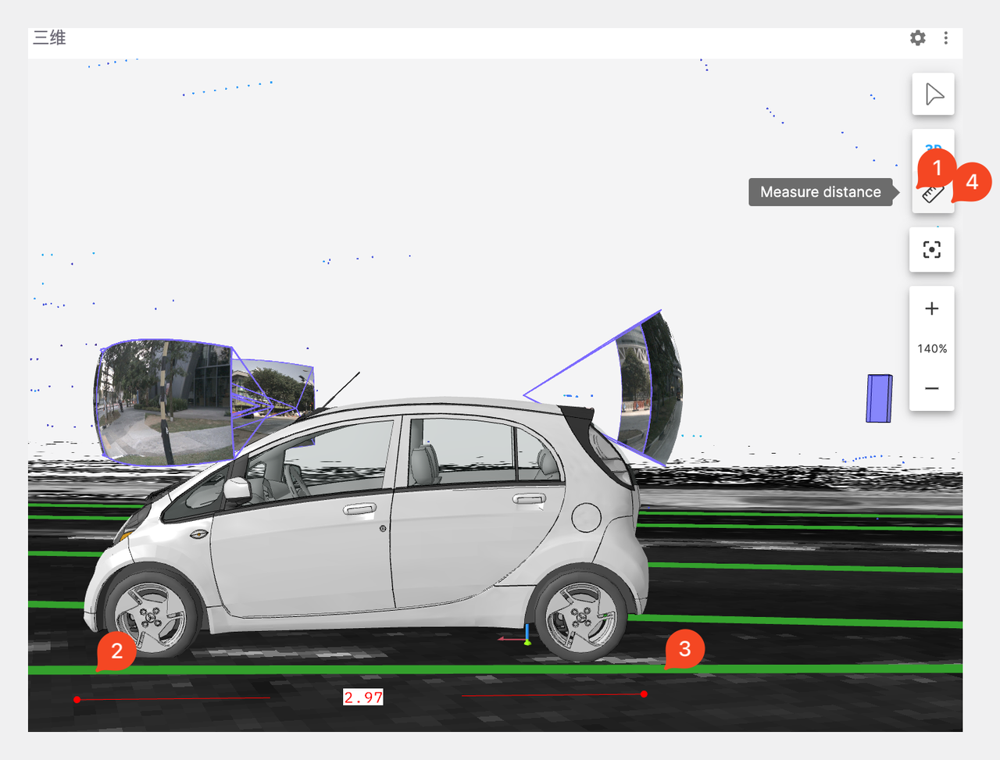

### Recenter & Zoom

Used to control the centering and zooming effects of the 3D view.

1. The **Recenter** button adjusts the view size to 100%.
2. Click the **+** and **-** buttons to zoom in and out of the view.
3. You can also use the keyboard and mouse to zoom in and out of the view.

    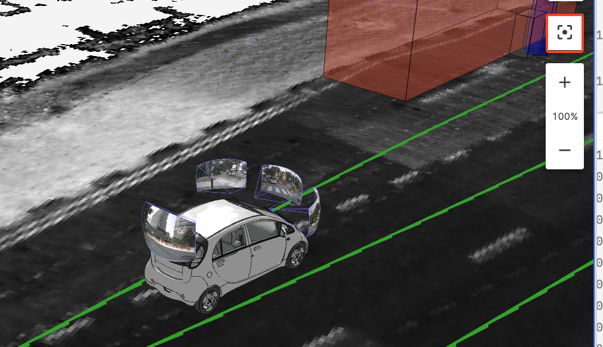

   ---
