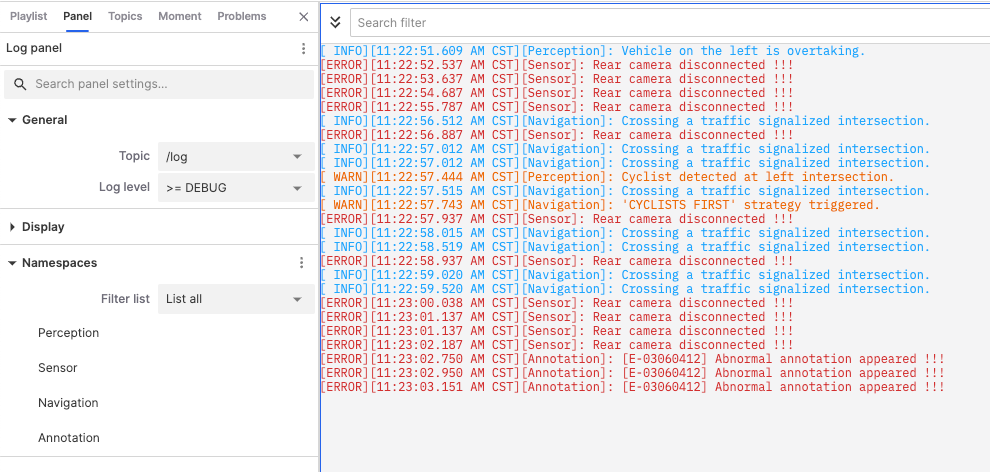
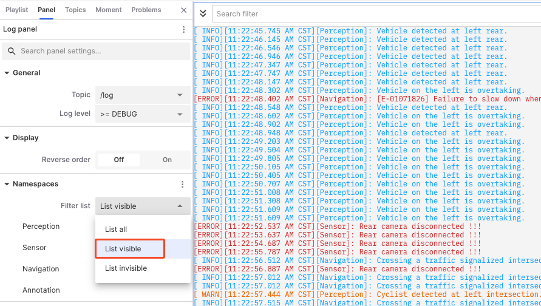
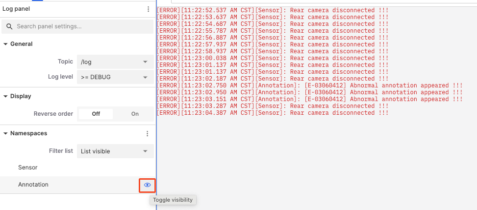
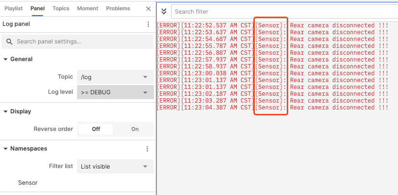

# Log Panel

The "Log Panel" is used to display and manage machine-generated log information. It helps users monitor, filter, and analyze various events and status updates in real-time during system operation.

## Properties in the Log Panel

### General

- **Topics**: Determines the specific log sources displayed in the log panel. For example, select '/rosout' to display logs from the ROS system; select other log topics to display information from [log files in records](../../3-collaboration/record/5-manage-file.md).
- **Log Level**: Used to filter log information, displaying only logs at or above the specified level. For example, selecting `>= DEBUG` will display logs at DEBUG level and above, including INFO, WARN, ERROR, etc.

### Display

- **Reverse order**: Controls the log display order. When turned off, logs are displayed in chronological order, with the oldest logs at the top.

### Namespace

- **Filter List**: Displays only the log information related to the specified namespace, making it easier to find and analyze logs for specific modules or functions.

### Example: Displaying Only `sensor` Logs

1. In the **Filter List**, select to list visible.

   

2. Hide other log modules.

   

3. View the filtered logs.

   

   ***
