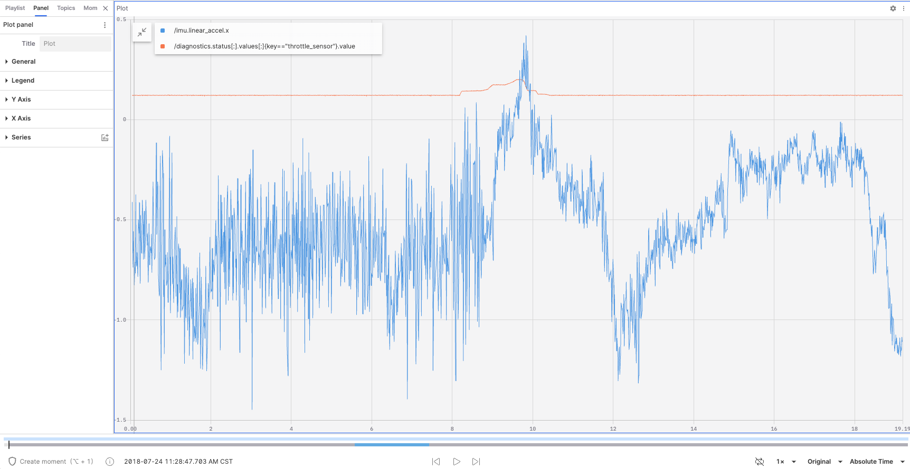
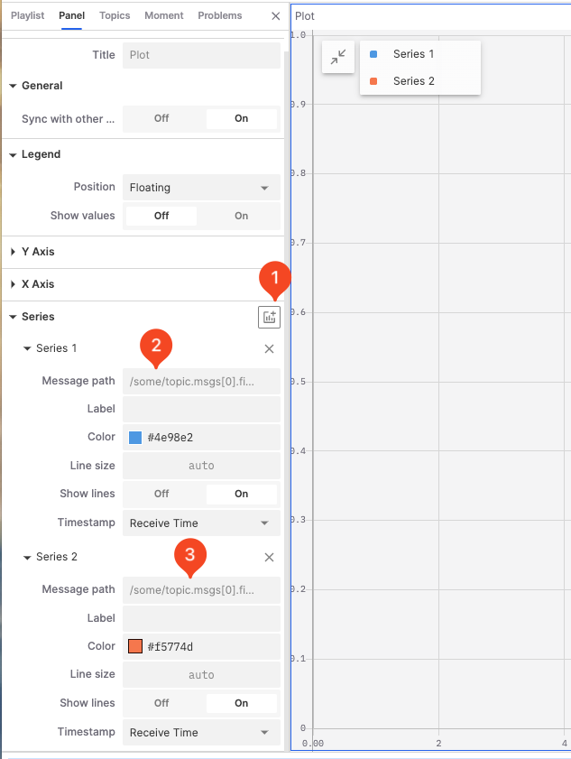
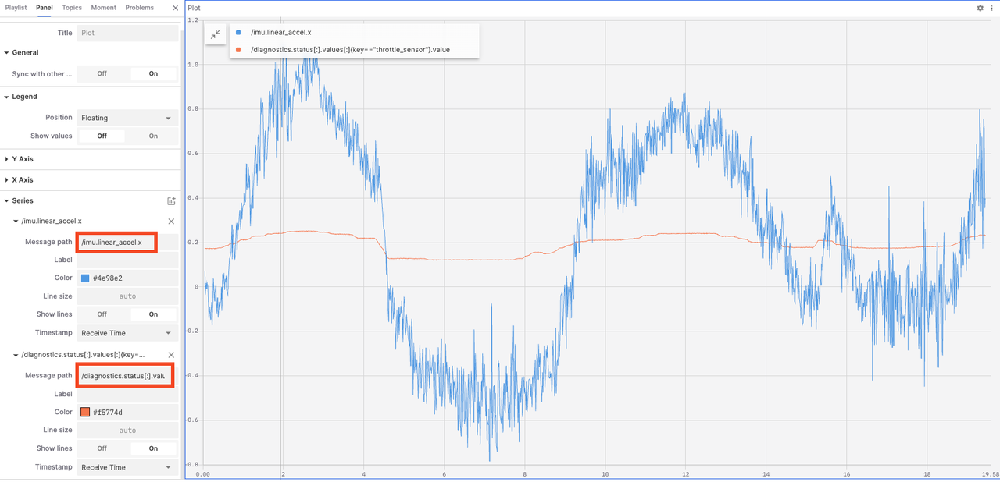
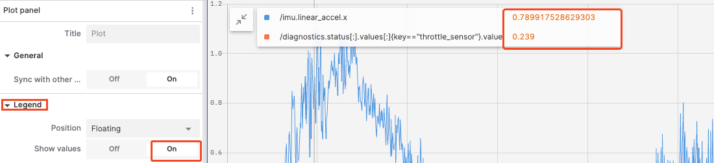
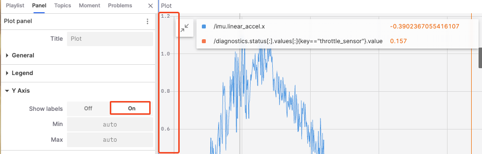
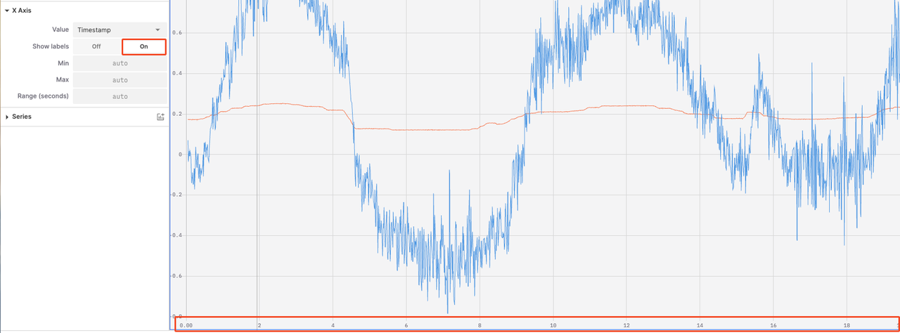
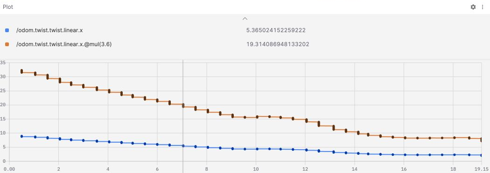
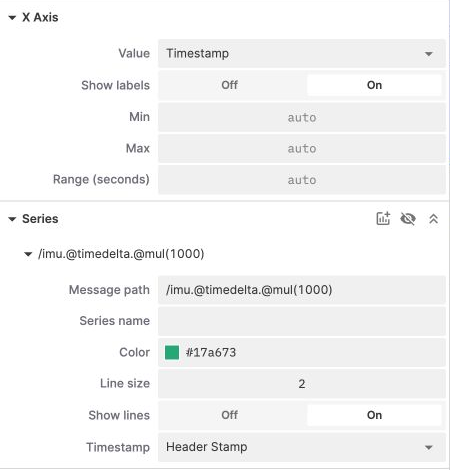
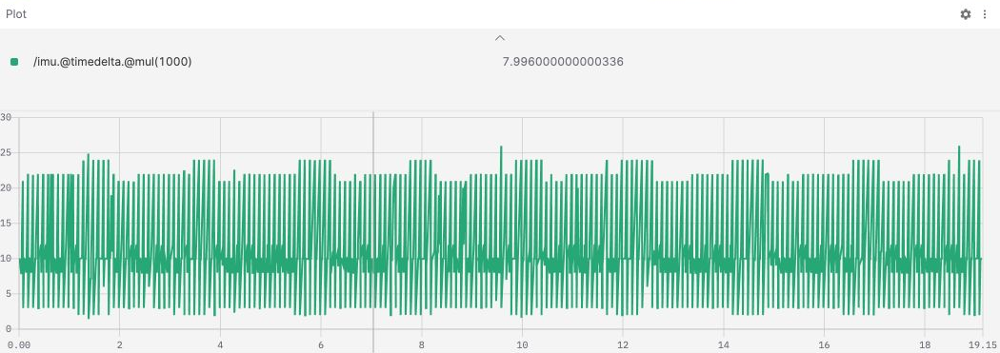

# Plot Panel: Visualizing Data Trends

The "Plot Panel" is a tool used for plotting and displaying data trends over time or other variables. It allows users to configure multiple data series and visualize these trends in a clear and intuitive chart format.



## Properties in the Plot Panel

### Data Series

1. **Add a new data series**

   

2. **Enter the message address**

   

3. **Configure the data series**

- **Label**: Set the label text for the data series.
- **Color**: Set the color for the data series.
- **Line Size**: Set the line width for the data series.
- **Show Lines**: Enable or disable lines connecting data points.
- **Timestamp**: Used to mark the time position of data points, ensuring that data is correctly plotted in the chart in chronological order.
  - **Receive Time**: Use the receive time as the timestamp to show the actual time the data arrived in the system.
  - **Header Timestamp**: Use the header timestamp to show the actual time the data occurred on the source device.

### General

- **Sync with other charts**: In a multi-chart view, enabling this option synchronizes the zoom and pan of multiple charts for easier comparison and analysis of data.

### Legend



- **Position**: Set the position of the legend; options include floating, left, top, and hidden.
- **Show Values**: Enable this to show data point values directly in the legend.

### Y Axis



- **Show Labels**: Control whether to display scale labels on the Y axis.
- **Min and Max Values**: Set the start and end values of the Y axis.

### X Axis



- **Values**: Choose the values displayed on the X axis, options include timestamp, index, address (current), and address (cumulative).
- **Show Labels**: Control whether to display scale labels on the X axis.
- **Max and Min Values**: Set the start and end values of the X axis.
- **Range (seconds)**: Control the length of the time span displayed on the X axis.

## Using message path functions {#message-path-functions}

**Message path** supports field selection, array slices, comparison filters, and function chains. See [Message Path Syntax](../message-path-syntax.md) for the full reference.

### Unit conversion

Add two data series with these expressions:

```text
/odom.twist.twist.linear.x
/odom.twist.twist.linear.x.@mul(3.6)
```

The first shows the original linear velocity in m/s; the second shows the converted velocity in km/h. Enable **Show values** under **Legend** to compare results at the same time.



Use `/odom.twist.twist.linear.@norm.@mul(3.6)` to calculate velocity magnitude before conversion. To plot an orientation angle, use `/odom.pose.pose.orientation.@ypr.yaw.@degrees`. See [Quaternions and Euler angles](../message-path-syntax.md#rotation-functions) for rotation orders and output fields.

### Time-series calculations {#time-series-functions}

`@delta`, `@derivative`, and `@timedelta` use consecutive samples to calculate changes, rates per second, and time intervals. Set **X Axis → Value** to **Timestamp**. Index, current custom, and accumulated custom X-axis modes do not support these functions.

To inspect IMU message intervals:

1. Enter `/imu.@timedelta.@mul(1000)` in **Message path** to convert seconds to milliseconds.
2. Select **Receive Time** or **Header Stamp** in the series' **Timestamp** setting.
3. Play or seek within the record to view the interval chart. The screenshots use **Header Stamp**.





The two time sources have different meanings: Receive Time reflects when messages were received or recorded, while Header Stamp reads `header.stamp` from each message. If messages arrive in batches, the two sources may produce different interval charts. Check that messages contain a valid `header.stamp` before selecting Header Stamp.

You can calculate intervals directly from a topic or filter by message fields first:

```text
/imu.@timedelta
/imu{header.frame_id=="imu_link"}.@timedelta.@mul(1000)
```

The second expression applies only to messages whose `header.frame_id` is `imu_link`. Intervals use consecutive matching messages. Fewer than two matches produce no valid interval result.

A path can contain at most one time-series function, followed only by scalar or arithmetic functions:

| Expression                                      | Validity                                                  |
| ----------------------------------------------- | --------------------------------------------------------- |
| `/odom.twist.twist.linear.x.@derivative.@abs`   | Valid: calculate a rate, then take its absolute value     |
| `/imu.@timedelta.@mul(1000)`                    | Valid: convert the interval to milliseconds               |
| `/odom.twist.twist.linear.x.@delta.@derivative` | Invalid: two time-series functions                        |
| `/imu.@timedelta.@norm`                         | Invalid: a vector function follows a time-series function |

The first sample has no valid difference result; samples with identical timestamps cannot produce a valid derivative. CSV exports include the results of time-series functions and any following arithmetic. See [Time-series functions](../message-path-syntax.md#time-series) for the formulas.
