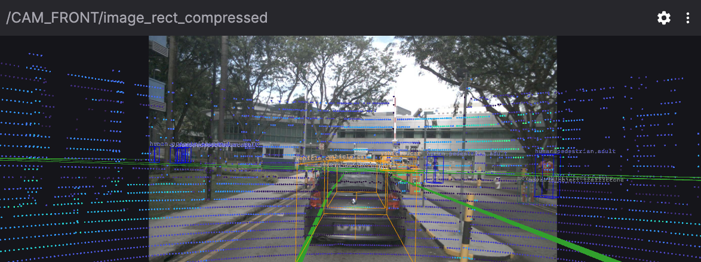
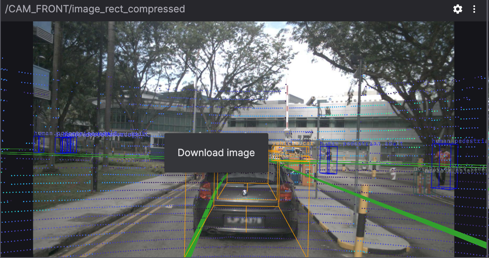
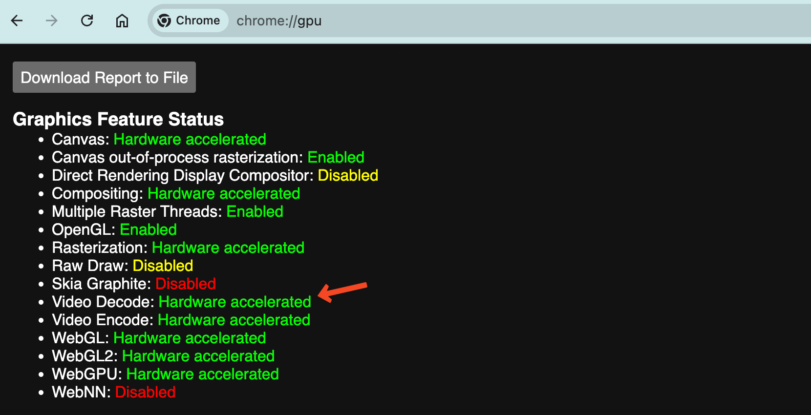

# Image Panel
Display raw and compressed images, as well as compressed videos, with 2D annotations like text labels, circles, and points. Superimpose 3D markers for additional context.

## Settings

### General Settings

- Topic: "Topic" refers to the category or channel of data streams. Each topic represents a specific type of data source or sensor data, such as camera images, LiDAR data, annotation information, etc.
- Calibration: Calibration topic to use for distortion and 3D markers
- Synchronize annotations: Display images and 2D annotations only when their messages' timestamps match. Newly received 2D annotation messages will be buffered until a matching set can be displayed. Not yet supported for CompressedVideo topics.
- Horizontal flip: Flip the image along the vertical axis
- Vertical flip: Flip the image along the horizontal axis
- Rotation: The angle of rotation of the image (0°, 90°, 180°, or 270°)
- Color mode:
  - Color mapping - A predefined color palette
  - Gradient - A smooth transition between two custom colors
- Color mapping: Displayed only when "Color mode" is set to "Color mapping". Used to map mono16 and 16UC1 image values to colors:
  - Turbo (Google)
  - Rainbow (RViz)
- Gradient: Displayed only when "Color mode" is set to "Gradient". Specifies the gradient color values for monochrome 16-bit and 16-bit unsigned single-channel images.
- Minimum value: The minimum scaling value for monochrome 16-bit and 16-bit unsigned single-channel depth images (default: 0).
- Maximum value: The maximum scaling value for monochrome 16-bit and 16-bit unsigned single-channel depth images (default: 10000).

### Scene
- Render stats: Display rendering performance statistics in the panel corner
- Background: The background color behind the image
- Label scale: The size of text labels
- Ignore COLLADA's \<up_axis\>：Ignore the \<up_axis\> tag in COLLADA files
- Mesh up axis: The "up" direction when loading a mesh model without orientation information (STL, OBJ format) ("Y up" or "Z up").

### Image Annotation
2D image annotation markers displayed on the image.

> See more settings in [3d panel](./5-3d-panel.md)

## User Interaction
Right-click on the image to download it as a PNG file format.

Click any displayed image marker to view its details.

Scroll the mouse wheel to zoom in and out, and drag to pan. The annotations are re-rendered to keep them clear when zooming.

## Screen tearing and stuttering
When the screen appears to tear and stutter, it may be due to video decoding delays. When the browser cannot use hardware acceleration to decode, it uses the system CPU to decode. The CPU decoding performance is significantly lower than hardware decoding, and the system CPU load and power consumption also affect decoding efficiency. Hardware acceleration decoding is usually faster and has less performance overhead. Please confirm that this feature is enabled.

## Check hardware acceleration:
You can check if your platform supports hardware acceleration video decoding by opening Google Chrome and entering <code>chrome://gpu</code> in the address bar. If you do not see <code>Video Decode: Hardware accelerated</code> or <code>Video Acceleration</code> section on this page, it means that hardware acceleration decoding is currently not enabled.

<table>
  <tr>
    <td>
    
    </td>
    <td>
    
    </td>
  </tr>
</table>

## Enable hardware acceleration:
Visit <code>chrome://settings</code>, search <code>acceleration</code>, ensure that <code>Use graphics acceleration when available</code> is enabled.

Visit <code>chrome://flags</code>, search <code>video</code>, ensure that <code>Hardware-accelerated video decode</code> is enabled.

MacOS:

For MacOS, when the graphics backend (graphics backend) is changed to use <code>Metal</code> in a Chromium-based browser, a significant performance improvement is observed. You can make the change in <code>about://flags</code>.

Linux:

- Note that Chrome/Chromium does not support video acceleration on Linux by default, and may require using custom Chrome/Chromium flags to enable GPU.
- Ensure that your graphics driver is updated and correctly installed.