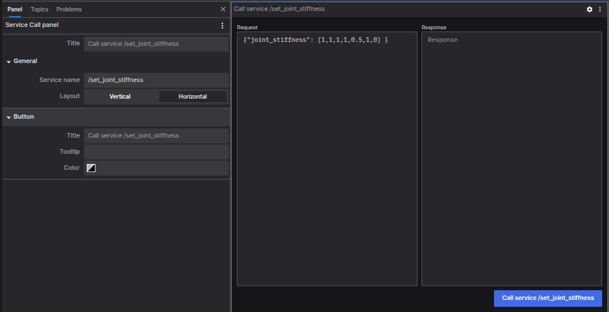

# Service Call Panel

The Service Call Panel allows the users to call ROS services via [coBridge](https://github.com/coscene-io/coBridge) and view the responses.

## Configuration Options

### Basic Settings

- **Service Name**: The name of the target service to be called
- **Layout**: Configure the arrangement of request and response areas
  - Vertical: Arranged top and bottom
  - Horizontal: Arranged left and right

### Button Settings

- **Title**: The text displayed on the button
- **Tooltip**: The hint text shown on mouse hover
- **Color**: Customize the button's display color

## Usage Instructions

1. Make sure you are connected to a supported data source, otherwise the "Call Service" button will remain disabled
2. In the request input area, write the service request content using standard JSON format
3. Click the "Call Service" button to send the request
4. The service response will automatically display in the response area

The Service Call Panel provides you with an intuitive interface for service-level interaction with the robot system. Through this panel, you can easily test various service calls, view response results in real-time, and effectively perform system debugging and functionality verification.
