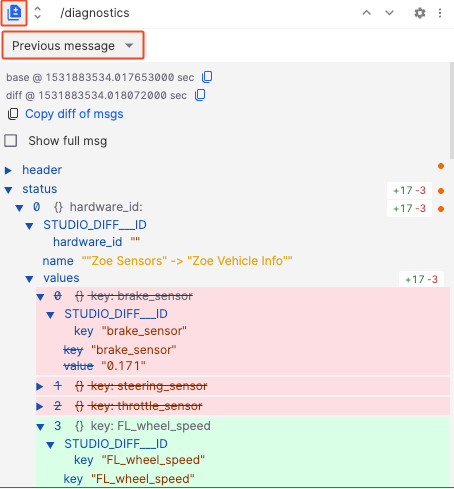
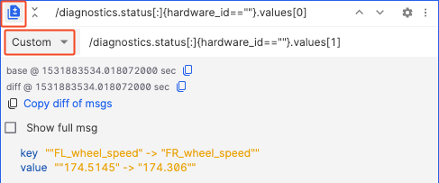
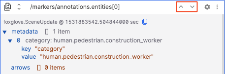

# Raw Messages

Inspect a particular message path in your data source.

As new messages are received for a given path, the collapsible tree will show just the latest message. You will be able to expand and collapse keys, and have those changes persist across playback.

## Settings

| Field | Description |
| --- | --- |
| Font Size | Font size for text display |

## Shortcuts

### Diff mode
Compare messages by showing additions (green), deletions (red), and changes (yellow) to their fields across 2 categories:

- "previous message" – Compare consecutive messages for a given message path
- "custom" – Compare different topic messages for a given timestamp

### Expand all
Click the icon next to the message path to expand or collapse all nested fields in the displayed message.

| Expand all | Collapse all |
| --- | --- |
|  |  |

### Frame by frame
When there are many messages, you can view them one by one using this feature.

By clicking the buttons or using the keyboard shortcuts `Up Arrow` and `Down Arrow`, you can navigate through the messages.

### Copy message
Click "Copy msg" to copy the current topic message to your clipboard.

