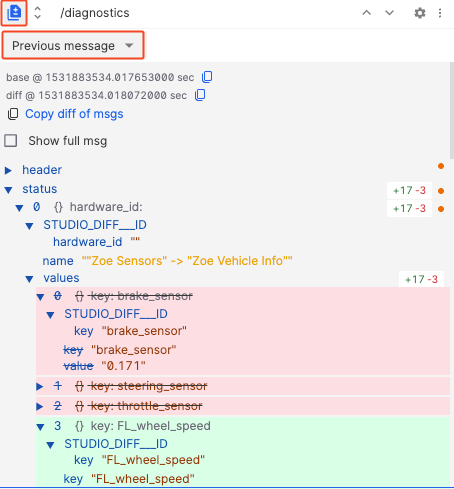
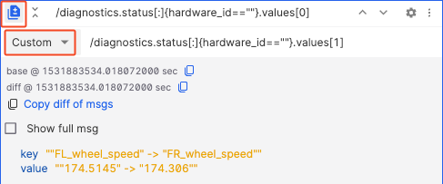
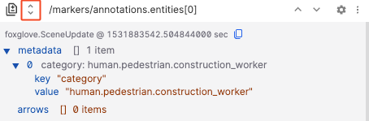
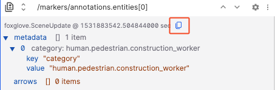

# Raw Messages

Inspect a particular message path in your data source.

As new messages are received for a given path, the collapsible tree will show just the latest message. You will be able to expand and collapse keys, and have those changes persist across playback.


## Selecting, filtering, and transforming messages {#message-paths}

The input at the top supports [message path syntax](../message-path-syntax.md). View an entire topic or select a field:

```text
/odom
/odom.twist.twist.linear.x
```

Use slices and filters to select array elements, then extract a field. These expressions show IDs from the first six objects and then keep only IDs of at least `40000`:

```text
/markers/annotations.markers[0:5].id
/markers/annotations.markers[0:5]{id>=40000}.id
```

See [Array filtering](../message-path-syntax.md#filters) for before-and-after screenshots. For diagnostic status fields with enum definitions, you can also use `/diagnostics.status[:]{level==OK}.name`.

Functions transform the result of an individual message. For example, `/imu.linear_acceleration.@norm` computes acceleration magnitude, while `/odom.pose.pose.orientation.@ypr` displays a converted Euler-angle object. Append `.yaw.@degrees` to show only yaw in degrees.

This panel does not support `@delta`, `@derivative`, or `@timedelta`. To calculate changes in value or time between consecutive samples, use [time-series functions in Plot](./4-plot-panel.md#time-series-functions).

## Settings

| Field     | Description                |
| --------- | -------------------------- |
| Font Size | Font size for text display |

## Shortcuts

### Diff mode

Compare messages by showing additions (green), deletions (red), and changes (yellow) to their fields across 2 categories:

- "previous message" – Compare consecutive messages for a given message path
- "custom" – Compare different topic messages for a given timestamp




### Expand all

Click the icon next to the message path to expand or collapse all nested fields in the displayed message.

| Expand all                                       | Collapse all                                     |
| ------------------------------------------------ | ------------------------------------------------ |
|  |  |

### Frame by frame

When there are many messages, you can view them one by one using this feature.

By clicking the buttons or using the keyboard shortcuts `Up Arrow` and `Down Arrow`, you can navigate through the messages.


### Copy message

Click "Copy msg" to copy the current topic message to your clipboard.


