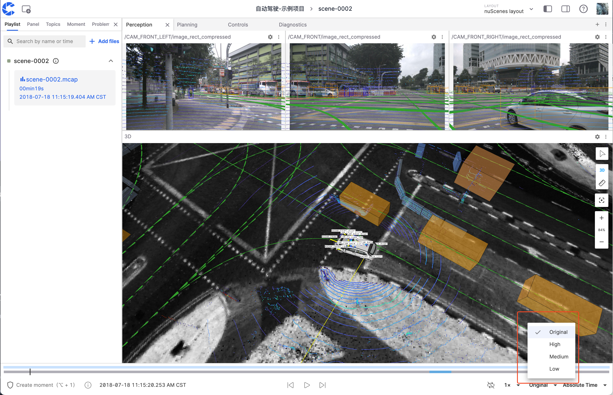

# Frame Rate Optimization Options

"Frame Rate Optimization Options" are used to achieve smooth playback by actively adjusting the frame rate of `topic` data when dealing with large data volumes and limited bandwidth.

## Settings

The "Frame Rate Optimization Options" are located in the bottom right corner of the visualization interface and provide four preset levels:

| Level    | Target Frame Rate                                |
| -------- | ------------------------------------------------ |
| Original | Maintain original data frame rate, no processing |
| High     | 60 fps                                           |
| Medium   | 30 fps                                           |
| Low      | 10 fps                                           |

:::warning

The following types of messages will not undergo any frame rate adjustment:

- `transform` type messages
- Data with inter-frame dependencies (such as `H.264` encoded video streams in `CompressedVideo`)

:::
