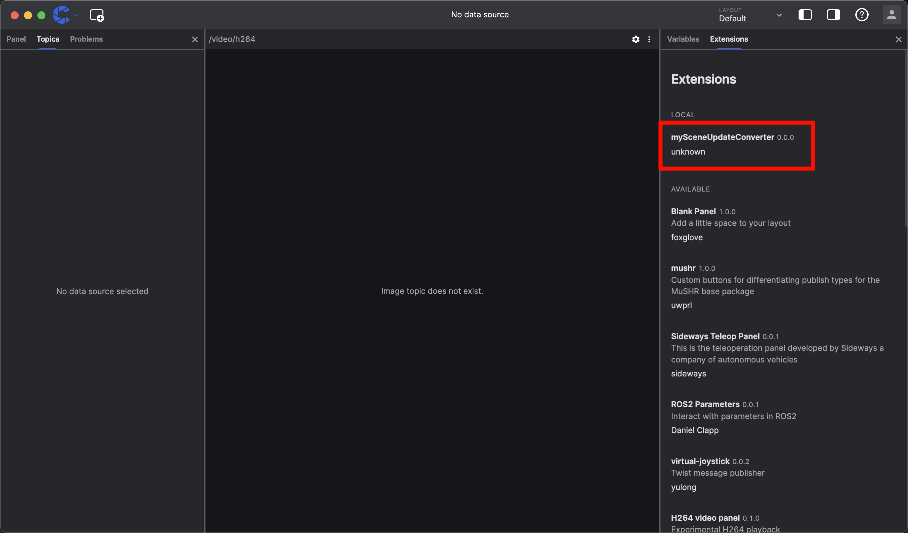

# Using Message Converters to Display 3D Markers in 3D Panel

By writing your own message converter, you can use coScene's existing panels to visualize your custom messages, even if these message definitions are not supported by the existing panels.

## Why Use Message Converters

While you could build a custom panel every time you want to visualize certain specific data, writing a message converter can save you a lot of time and effort. Message converters transform data into supported formats, allowing existing panels to handle the visualization without having to build another panel from scratch.

## Our Goal

We will create a message converter that transforms custom `my.Marker` messages into `foxglove.SceneUpdate` messages, then use the 3D panel to display these markers. You can download the [example mcap file](https://download.coscene.cn/assets/bags/example.mcap) for this tutorial.

## Prerequisites

Before we begin, you should be familiar with or have installed:

- Basic robotics concepts
- Basic usage of coScene visualization features
- [Basic JavaScript/TypeScript syntax](https://www.typescriptlang.org/docs/handbook/basic-types.html)
- [Basic usage of frontend package managers like npm](https://docs.npmjs.com/)
- [Node.js version 14 or higher installed on your current device](https://nodejs.org/en/download/)

## Initialize the Project

Create a project using [create-coscene-extension](https://github.com/coscene-io/create-coscene-extension):

```bash
npm init coscene-extension@latest mySceneUpdateConverter
```

This command will create a `mySceneUpdateConverter` directory containing some template source code.

## Write the Converter

src/index.ts is the entry point for the plugin source code. It exports an `activate` function that accepts a single parameter of type [`ExtensionContext`](/docs/viz/extensions/api/entry-point/extension-context).

First, let's add the `@foxglove/schemas` package to our project. `@foxglove/schemas` is foxglove's schema definition library, where you can find all foxglove-supported schema definitions:

```bash
npm install @foxglove/schemas
```

Then, open the `src/index.ts` file and import the following packages:

```ts
// Import coScene's plugin context
import { ExtensionContext } from '@coscene/extension';
// Import foxglove's schema definitions
import { CubePrimitive, SceneUpdate } from '@foxglove/schemas';
// Import foxglove's time type definition
import { Time } from '@foxglove/schemas/schemas/typescript/Time';
```

And declare our custom `my.Marker` message type:

```ts
// Declare our custom `my.Marker` message type
type DetectedObject = {
  position: [number, number, number];
  markerType: 'adult' | 'car' | 'truck';
  scale: [number, number, number];
  timestamp: Time;
  frameId: string;
};
```

To register the message converter, we need to call the `registerMessageConverter` function from `extensionContext`. The `registerMessageConverter` function requires three parameters:

- fromSchemaName: The message type defined in mcap that needs to be converted
- toSchemaName: The target message type after conversion
- converter: The function that performs the conversion, which accepts the message registered in fromSchemaName. We need to convert the message to the type registered in toSchemaName

```ts
// Register the message converter
export function activate(extensionContext: ExtensionContext) {
  extensionContext.registerMessageConverter({
    fromSchemaName: 'my.Marker',
    toSchemaName: 'foxglove.SceneUpdate',
    converter: (inputMessage: DetectedObject): SceneUpdate => {
      // Conversion logic from my.Marker to foxglove.SceneUpdate
    },
  });
}
```

Fill in the converter function to transform `my.Marker` messages into `foxglove.SceneUpdate` messages. We'll display all detected objects as colored cubes:

- Blue for adults
- Red for cars
- Green for trucks

```ts
converter: (inputMessage: DetectedObject): SceneUpdate => {
  const { position, scale, markerType, timestamp, frameId } = inputMessage;
  const colorMap = {
    adult: { r: 0, g: 0, b: 1, a: 1 },
    car: { r: 1, g: 0, b: 0, a: 1 },
    truck: { r: 0, g: 1, b: 0, a: 1 },
  };

  const cubePrimitive: CubePrimitive = {
    pose: {
      position: { x: position[0], y: position[1], z: position[2] },
      orientation: { x: 0, y: 0, z: 0, w: 1 },
    },
    size: { x: scale[0], y: scale[1], z: scale[2] },
    color: colorMap[markerType],
  };

  const sceneUpdateMessage = {
    deletions: [],
    entities: [
      {
        id: 'detectedObjects-entities',
        timestamp,
        frame_id: frameId,
        lifetime: { sec: 10, nsec: 0 },
        frame_locked: false,
        metadata: [],
        arrows: [],
        cubes: [cubePrimitive],
        spheres: [],
        cylinders: [],
        lines: [],
        triangles: [],
        texts: [],
        models: [],
      },
    ],
  };

  return sceneUpdateMessage;
};
```

## Test the Plugin

To build and install the plugin for local testing in coStudio, run the following command in the plugin directory:

```bash
npm run local-install
```

In coStudio, open the plugin list on the right side, and you'll now see `mySceneUpdateConverter` in the list of installed plugins:


Now, open our example mcap file, and you can open the 3D panel to see all detected objects displayed as colored cubes:


## Share Your Plugin

To share your plugin with others, you need to package it as a .coe file. To do this, run the following command in the plugin directory:

```bash
npm run package
```

You'll find an `unknown.mySceneUpdateConverter-0.0.0.coe` file in the plugin directory. You can distribute this to others, and they can install it in their coStudio by dragging and dropping it.
