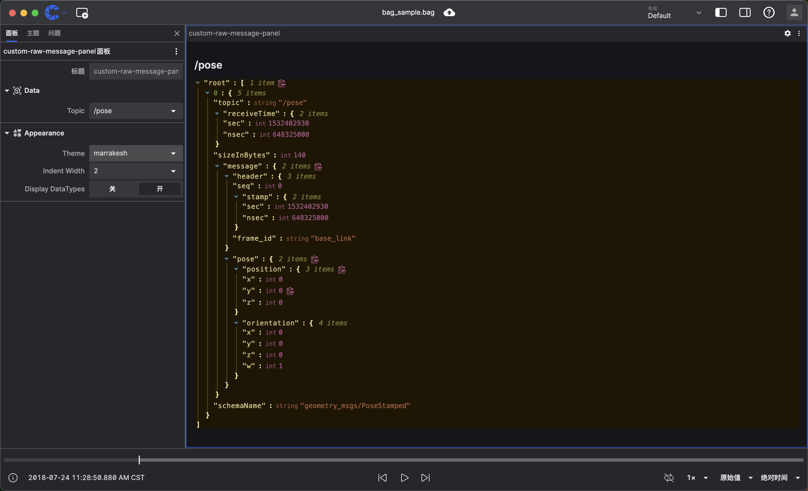

# Custom Panel

By writing your own panel, you can have more flexible control over the panel's appearance and behavior to meet your specific needs.

## Why Use Custom Panels

Custom panels are very useful when existing panels don't support your visualization needs. You have complete control over the panel's appearance and behavior to meet your specific requirements.

## Our Goal

We will create a custom panel that simulates the original message panel, using [react-json-view](https://github.com/microlinkhq/react-json-view) to display the raw messages for the corresponding topic.

## Before You Begin

Before starting, you need to understand/install some basic concepts/environments:

- Basic robotics concepts
- Basic usage of coScene visualization features
- [Basic JS/TS syntax](https://www.typescriptlang.org/docs/handbook/basic-types.html)
- [Basic React usage](https://react.dev/)
- [Basic usage of frontend package managers like npm](https://docs.npmjs.com/)
- [Node.js version 14 or higher installed on your current device](https://nodejs.org/en/download/)

## Initialize Project

Create a project using [create-coscene-extension](https://github.com/coscene-io/create-coscene-extension):

```bash
npm init coscene-extension@latest custom-raw-message-panel
```

This command will create a `custom-raw-message-panel` directory containing some template source code.

Then, we need to install some dependencies in our project:

- `@microlink/react-json-view` is a React component for displaying JSON data
- `immer` is a JavaScript library for handling immutable state
- `lodash` is a well-known JavaScript utility library that provides many useful functions, including array operations, object operations, etc.

```bash
npm install @microlink/react-json-view immer lodash
```

Then we open the `package.json` file and modify the `displayName` and `description` fields to `custom raw message panel`. The modified `package.json` file should look like this:

```json
{
  "name": "custom-raw-message-panel",
  "displayName": "custom raw message panel",
  "description": "custom raw message panel",
  ...
}
```

## Write Custom Panel

Now open the `custom-raw-message-panel` folder in your chosen editor, then open the `src/index.ts` file. You'll see that the file already registers an example panel as `example-panel`. First, we need to change this example panel's name to `custom-raw-message-panel`. The modified `index.ts` file should look like this:

```ts
import { ExtensionContext } from '@coscene/extension';

import { initExamplePanel } from './ExamplePanel';

export function activate(extensionContext: ExtensionContext): void {
  extensionContext.registerPanel({
    name: 'custom-raw-message-panel',
    initPanel: initExamplePanel,
  });
}
```

Then we open the `src/ExamplePanel.tsx` file. In the `src/ExamplePanel.tsx` file, you'll see a simple panel component. We need to first explain the code in this file, then modify it according to our needs. This file uses React's state management to track subscribed topics, messages, and their rendering state.

```ts
function ExamplePanel({ context }: { context: PanelExtensionContext }): JSX.Element {
  const [topics, setTopics] = useState<readonly Topic[] | undefined>();
  const [messages, setMessages] = useState<readonly MessageEvent<unknown>[] | undefined>();

  const [renderDone, setRenderDone] = useState<() => void | undefined>();
```

In the example, when relevant updates are detected, the `onRender` event will run:

```ts
useLayoutEffect(() => {
  context.onRender = (renderState: RenderState, done) => {
    setRenderDone(() => done);
    setTopics(renderState.topics);
    setMessages(renderState.currentFrame);
  };
}, [context]);
```

The onRender function receives the latest panel state:

- `done` is a callback function after the new rendering is complete. When rendering is complete, you need to call the `done` function to indicate that the panel has completed the previous rendering cycle
- `renderState.topics` is the latest topic list
- `renderState.currentFrame` contains new messages for subscribed topics

Next, use the `context.watch` function to tell the context which states need to be monitored. When the state changes, it will trigger the `onRender` event. `context.watch` is used to monitor key values in [`RenderState`](/docs/viz/extensions/api/custom-panels/render-state). You can view all monitorable key values from [`RenderState`](/docs/viz/extensions/api/custom-panels/render-state)

```ts
context.onRender = (renderState: RenderState, done) => {
  // ...
};
// Tell the panel context we care about changes in the _topic_ field in RenderState
context.watch('topics');
// Tell the panel context we want to subscribe to messages in the current frame
context.watch('currentFrame');
```

Then we need to use the `context.subscribe` function to subscribe to the topic array. Messages from these topics will be populated into `renderState.currentFrame`

```ts
context.subscribe(['/some/topic']);
```

Finally, when the panel finishes rendering, we need to call the `renderDone` function to indicate that the panel has completed the previous rendering cycle

```ts
useEffect(() => {
  renderDone?.();
}, [renderDone]);
```

At the bottom of the function, we can see how to use all this logic to render a table of data source topics and schema names

```ts
return (
  <div style={{ padding: "1rem" }}>
    <h2>Welcome to your new extension panel!</h2>
    {/* ... */}
    {(topics ?? []).map((topic) => (
      <>
        <div key={topic.name}>{topic.name}</div>
        <div key={topic.datatype}>{topic.datatype}</div>
      </>
    ))}
    {/* ... */}
  </div>
);
```

According to our needs, in the settings we need to let users choose the topic to display, and let users choose the theme supported by `@microlink/react-json-view`, indentation, and whether to display data types.

So we need to first define the TypeScript types for settings: State, and the themes supported by `@microlink/react-json-view` `ThemeOptions`.

```ts
// Themes supported by @microlink/react-json-view
const ThemeOptions = [
  'apathy',
  'apathy:inverted',
  'ashes',
  'bespin',
  'brewer',
  'bright:inverted',
  'bright',
  'chalk',
  'codeschool',
  'colors',
  'eighties',
  'embers',
  'flat',
  'google',
  'grayscale',
  'grayscale:inverted',
  'greenscreen',
  'harmonic',
  'hopscotch',
  'isotope',
  'marrakesh',
  'mocha',
  'monokai',
  'ocean',
  'paraiso',
  'pop',
  'railscasts',
  'rjv-default',
  'shapeshifter',
  'shapeshifter:inverted',
  'solarized',
  'summerfruit',
  'summerfruit:inverted',
  'threezerotwofour',
  'tomorrow',
  'tube',
  'twilight',
].map((key) => ({ value: key, label: key }));

// This is the type we'll use when rendering the panel and persist to the layout.
type State = {
  data: {
    label: string;
    topic?: string;
    visible: boolean;
  };
  appearance: {
    displayDataTypes: boolean;
    indentWidth: string;
    theme: string;
  };
};
```

Then we need to use React's `useState` to manage the settings state and declare a function to update the settings state.

```ts
import { produce } from 'immer';
import { set } from 'lodash';

// Build our panel state from the context's initialState, filling in any missing values.
const [state, setState] = useState<State>(() => {
  const partialState = context.initialState as Partial<State>;
  return {
    data: {
      label: partialState.data?.label ?? 'Data',
      topic: partialState.data?.topic ?? '/pose',
      visible: partialState.data?.visible ?? true,
    },
    appearance: {
      displayDataTypes: partialState.appearance?.displayDataTypes ?? true,
      theme: partialState.appearance?.theme ?? 'rjv-default',
      indentWidth: partialState.appearance?.indentWidth ?? '2',
    },
  };
});

// Update our state in response to edit operations from the settings panel.
const actionHandler = useCallback(
  (action: SettingsTreeAction) => {
    if (action.action === 'update') {
      const { path, value } = action.payload;

      // We combine immer and lodash to generate a new state object, so React can re-render the panel.
      // Since our data node contains label and visibility properties, this combination can automatically handle label editing and node visibility toggling,
      // without needing to write special handling logic.
      setState(produce((draft) => set(draft, path, value)));

      // If the topic is changed, update our subscription.
      if (path[1] === 'topic') {
        context.subscribe([{ topic: value as string }]);
      }
    }
  },
  [context],
);
```

Next, we use `context.updatePanelSettingsEditor` to register settings in our panel, and when the settings state changes, use `context.saveState` to save the state to the layout.

```ts
// Update the settings editor each time our state or available topic list changes.
useEffect(() => {
  // Save current state to layout
  context.saveState(state);

  const topicOptions = (topics ?? []).map((topic) => ({ value: topic.name, label: topic.name }));

  // We set up the settings tree to mirror the shape of our panel state, so we can use paths from the settings tree to directly update our state.
  context.updatePanelSettingsEditor({
    actionHandler,
    nodes: {
      data: {
        // Our label comes from the label in state, and will update to reflect changes in the state value.
        label: state.data.label,
        // Setting this to true allows users to edit this node's label.
        renamable: true,
        // A non-undefined value here allows users to toggle this node's visibility.
        visible: state.data.visible,
        icon: 'Cube',
        fields: {
          topic: {
            label: 'Topic',
            input: 'select',
            options: topicOptions,
            value: state.data.topic,
          },
        },
      },
      appearance: {
        label: 'Appearance',
        icon: 'Shapes',
        fields: {
          theme: {
            label: 'Theme',
            input: 'select',
            value: state.appearance.theme,
            options: ThemeOptions,
          },
          indentWidth: {
            label: 'Indent Width',
            input: 'select',
            value: state.appearance.indentWidth,
            options: [
              { value: '2', label: '2' },
              { value: '4', label: '4' },
              { value: '8', label: '8' },
            ],
          },
          displayDataTypes: {
            label: 'Display DataTypes',
            input: 'boolean',
            value: state.appearance.displayDataTypes,
          },
        },
      },
    },
  });
}, [context, actionHandler, state, topics]);
```

Then we need to make two small changes:

- Check if `renderState.currentFrame` is undefined, if it is undefined, keep the data from the previous frame, don't clear the message.
- Listen to the topic set in settings during initialization

```ts
useLayoutEffect(() => {
  context.onRender = (renderState, done) => {
    ...

    // If currentFrame is undefined, keep the data from the previous frame, don't clear the message.
    if (renderState.currentFrame) {
      setMessages(renderState.currentFrame);
    }
  };

  // After adding the render handler, you must specify which fields in the render state (RenderState) will trigger updates.
  // If you don't monitor any fields, the panel context will think you don't need any updates, so the panel won't render.

  // Tell the panel context we care about changes in the _topic_ field in RenderState
  context.watch("topics");

  // Tell the panel context we want to subscribe to messages in the current frame
  context.watch("currentFrame");

  // Subscribe to our initial topic
  if (state.data.topic) {
    context.subscribe([{ topic: state.data.topic }]);
  }
}, [context, state.data.topic]);
```

Finally, just use `@microlink/react-json-view` to draw the corresponding messages in the `return`.

```ts
return (
  <div style={{ padding: "1rem", display: "flex", flexDirection: "column", maxHeight: "100%" }}>
    <h2>{state.data.topic ?? "Choose a topic in settings"}</h2>
    <div
      style={{
        overflowY: "auto",
        flex: 1,
      }}
    >
      <ReactJson
        src={messages ?? {}}
        displayDataTypes={state.appearance.displayDataTypes}
        theme={state.appearance.theme as ThemeKeys}
        indentWidth={Number(state.appearance.indentWidth)}
      />
    </div>
  </div>
);
```

> You can find the complete code [here](https://github.com/coscene-io/create-coscene-extension/tree/main/examples/panel-settings)

## Test Plugin

To build and install the plugin for local testing in coStudio, run the following command in the plugin directory:

```bash
npm run local-install
```

In coStudio, open the plugin list on the right side, and you'll now see `custom raw message panel` in the list of installed plugins:


The panel list will also have a new `custom-raw-message-panel` panel. Add our panel and open any file, and you can use our custom `custom-raw-message-panel` panel:


You can choose the topic you want to view in the settings and customize the panel's appearance to view messages for the corresponding topic in the panel:


## Share Your Plugin

To share your plugin with others, you need to package it as a .coe file. To do this, run the following command in the plugin directory:

```bash
npm run package
```

You'll find an `unknown.custom-raw-message-panel-0.0.0.coe` file in the plugin directory. You can distribute this to others, and they can install it in their coStudio instance by dragging and dropping it.
