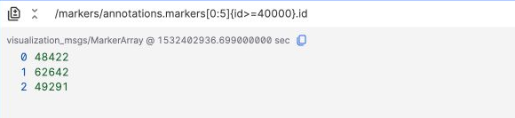
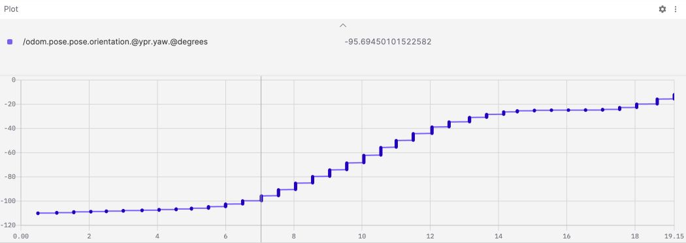
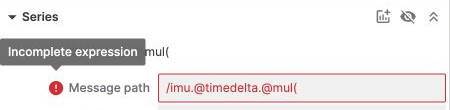

# Message Path Syntax

Message paths select fields from a topic, filter messages or array elements, and transform results with functions. For example, `/odom.twist.twist.linear.x.@mul(3.6)` reads the X component of linear velocity from an odometry message and converts m/s to km/h.

Enter an expression in the **Message path** setting of the [Plot panel](./4-panel/4-plot-panel.md) or the input at the top of the [Raw Messages panel](./4-panel/9-raw-messages.md). Gauge, Indicator, and State Transitions also support message paths, with differences in function and variable support. See [Panel support](#panel-support).

## Quick start {#quick-start}

1. Open a record and add a Raw Messages or Plot panel.
2. Enter a topic name, such as `/odom`, then use `.` to navigate its fields.
3. Append `.@function` to a numeric field, such as `.@abs` or `.@mul(3.6)`.
4. Play or seek to a time containing messages for that topic to view the result.

Autocomplete suggests fields and functions based on the data source's message structure. The example topics and fields must exist in your data source; adapt the paths to your messages.


## Topics and fields {#topics-and-fields}

Consider this example message on `/robot_state`:

```json
{
  "speed": 2.5,
  "status": 1,
  "objects": [
    { "id": 101, "confidence": 0.96 },
    { "id": 102, "confidence": 0.65 },
    { "id": 103, "confidence": 0.89 }
  ]
}
```

| Expression                           | Result             |
| ------------------------------------ | ------------------ |
| `/robot_state`                       | The entire message |
| `/robot_state.speed`                 | `2.5`              |
| `/robot_state.objects[0].confidence` | `0.96`             |

Use dots to access nested objects, for example `/odom.pose.pose.orientation`. Message paths are not general-purpose scripts: use the field, slice, filter, and function syntax below rather than arithmetic expressions such as `speed * 3.6`.

## Array indices and slices {#arrays}

Array indices start at `0`; negative indices count from the end. Slices use `[start:end]` and **include the end index**.

| Expression                       | Result for the example message above |
| -------------------------------- | ------------------------------------ |
| `/robot_state.objects[0].id`     | `101`                                |
| `/robot_state.objects[-1].id`    | `103`                                |
| `/robot_state.objects[0:1].id`   | `101, 102`                           |
| `/robot_state.objects[:].id`     | `101, 102, 103`                      |
| `/robot_state.objects[-2:-1].id` | `102, 103`                           |

Omit the start index to start at the beginning, or omit the end index to continue to the end. An out-of-range index or a slice containing no elements returns no values.

Field access after a slice applies to each selected element. In the following playback screenshot, `/markers/annotations.markers[0:5].id` selects the first **6** object IDs.


## Filters {#filters}

Append `{field operator value}` to a topic or selected object. Supported operators are `==`, `!=`, `<`, `<=`, `>`, and `>=`. Filters can compare numeric, string, and boolean fields.

### Filter entire messages

```text
/robot_state{speed>=2}.speed
```

This returns the speed only for messages whose `speed` is at least `2`. A nonmatching message is skipped; it does not produce a `0`.

Filter fields are resolved relative to the current object. Use dots to access nested fields:

```text
/odom{twist.twist.linear.x>0}.twist.twist.linear.x
```

### Filter array elements

Select elements with a slice, then apply a filter:

```text
/robot_state.objects[:]{confidence>=0.8}.id
```

For the example message above, this returns `101, 103`. In the actual playback below, this expression keeps IDs of at least `40000` among the first six objects:

```text
/markers/annotations.markers[0:5]{id>=40000}.id
```



### Multiple conditions and strings

Consecutive filters require all conditions to match, forming an AND expression:

```text
/robot_state.objects[:]{confidence>=0.8}{id!=101}.id
```

This returns `103`. Quote string values; use unquoted `true` and `false` for booleans:

```text
/diagnostics.status[:]{name=="Zoe Sensors"}.level
/robot_state{enabled==true}.speed
```

The last expression requires a boolean `enabled` field in the message. Filter strings accept single or double quotes, but do not support escaping quotes inside the string. Use the other quote style when a string contains one type of quote.

### Enum names {#enum-filters}

When the message structure provides enum definitions for a field, you can use an unquoted enum name. Names are case-sensitive and must match that field's definition.

For example, the diagnostic status `OK` corresponds to `0`:

```text
/diagnostics.status[:]{level==OK}.name
/diagnostics.status[:]{level==0}.name
```


`{level==OK}` compares an enum, while `{name=="OK"}` compares a string. A numeric field alone does not establish enum names. Use a numeric filter if the data source does not provide recognizable enum definitions.

:::note
Filter autocomplete currently offers mainly equality examples. You can type other comparison operators and enum names manually.
:::

## Variables {#variables}

Define variables in the right sidebar, then reference them with `$name` in slice indices, filter values, or arithmetic function arguments. For example, set `start = 0`, `end = 1`, `target_id = 101`, and `scale = 3.6`:

```text
/robot_state.objects[$start:$end].id
/robot_state.objects[:]{id==$target_id}.confidence
/robot_state.speed.@mul($scale)
```

Use integers for slice indices, numbers or strings for filter variables, and finite numbers for arithmetic arguments. Variables cannot replace topic, field, or function names. Gauge and Indicator do not support variables in message paths; use literal values instead.

## Functions {#functions}

Append `.@function` to a path. Functions without arguments do not need parentheses; functions with an argument use `.@function(argument)`. The function must accept the input's data type.

### Scalar functions

These functions take a number and return a number. Trigonometric functions use radians.

| Function                  | Effect                                                            |
| ------------------------- | ----------------------------------------------------------------- |
| `@abs`                    | Absolute value                                                    |
| `@negative`               | Negate the value                                                  |
| `@sign`                   | Return the sign: `-1`, `0`, or `1`                                |
| `@ceil`                   | Round up to an integer                                            |
| `@round`                  | Round to the nearest integer; ties round toward positive infinity |
| `@trunc`                  | Remove the fractional part                                        |
| `@sqrt`                   | Square root                                                       |
| `@log`                    | Natural logarithm                                                 |
| `@log1p`                  | Natural logarithm of `1 + x`                                      |
| `@log2`                   | Base-2 logarithm                                                  |
| `@log10`                  | Base-10 logarithm                                                 |
| `@sin`, `@cos`, `@tan`    | Sine, cosine, tangent; input in radians                           |
| `@asin`, `@acos`, `@atan` | Inverse trigonometric functions; output in radians                |
| `@degrees`                | Convert radians to degrees                                        |
| `@radians`                | Convert degrees to radians                                        |

```text
/imu.linear_acceleration.x.@abs
/imu.angular_velocity.z.@degrees
```

### Arithmetic functions with arguments

| Function  | Effect          |
| --------- | --------------- |
| `@add(n)` | Add `n`         |
| `@sub(n)` | Subtract `n`    |
| `@mul(n)` | Multiply by `n` |
| `@div(n)` | Divide by `n`   |

The argument must be a finite number or a numeric variable supported by the panel. For example:

```text
/odom.twist.twist.linear.x.@mul(3.6)
```

This converts m/s to km/h. See [Unit conversion in the Plot panel](./4-panel/4-plot-panel.md#message-path-functions) for the steps and comparison chart.

### Array length and vector magnitude

| Function  | Input                                                                        | Result                               |
| --------- | ---------------------------------------------------------------------------- | ------------------------------------ |
| `@length` | An array or typed array                                                      | Array length; `0` for an empty array |
| `@norm`   | A numeric array, or an object with numeric `x`, `y`, and optional `z` fields | Euclidean magnitude                  |

```text
/markers/annotations.markers.@length
/odom.twist.twist.linear.@norm
```

Apply `@length` directly to the array. `markers[:].@length` attempts to take the length of each selected element; it does not count the selected elements. `@norm` cannot use an empty array or input containing nonfinite values.

### Quaternions and Euler angles {#rotation-functions}

Quaternion conversions take a unit quaternion object with numeric `x`, `y`, `z`, and `w` fields. The resulting `roll`, `pitch`, and `yaw` are in radians. Each function uses the rotation order listed below:

| Function | Input → Output                                         | Rotation order |
| -------- | ------------------------------------------------------ | -------------- |
| `@rpy`   | Quaternion → `roll`, `pitch`, `yaw`                    | XYZ            |
| `@ypr`   | Quaternion → `roll`, `pitch`, `yaw`                    | ZYX            |
| `@yrp`   | Quaternion → `roll`, `pitch`, `yaw`                    | ZXY            |
| `@quat`  | `roll`, `pitch`, `yaw` in radians → `x`, `y`, `z`, `w` | ZYX            |

For a single numeric result, select a field after the conversion, then optionally convert its units:

```text
/odom.pose.pose.orientation.@ypr.yaw.@degrees
```



After `@quat`, you can access `.x`, `.y`, `.z`, or `.w`. Raw Messages can display the entire converted object. Panels that need numbers, such as Plot, should select an output field.

:::note
`@quat` uses ZYX order; it is not the inverse of the XYZ conversion performed by `@rpy`. Euler angles are calculated independently for each message and are not unwrapped into continuously accumulated angles. Expect jumps across angle boundaries and potentially sharp changes near gimbal lock.
:::

### Chaining functions {#function-chains}

Functions run from left to right, with each step receiving the previous step's result:

```text
/odom.twist.twist.linear.@norm.@mul(3.6)
/imu.linear_acceleration.x.@abs.@add(1)
```

The first expression computes linear velocity magnitude, then converts it to km/h. After a structure conversion, access only its defined output fields, such as `@ypr.yaw`. Do not access object fields on a numeric result.

## Time-series functions {#time-series}

Time-series functions calculate results from consecutive samples. They are available **only in Plot with a Timestamp X axis**.

| Function      | Calculation                         | Purpose                                  |
| ------------- | ----------------------------------- | ---------------------------------------- |
| `@delta`      | `y[n] - y[n-1]`                     | Change in value between samples          |
| `@derivative` | `(y[n] - y[n-1]) / (t[n] - t[n-1])` | Rate of change per second                |
| `@timedelta`  | `t[n] - t[n-1]`                     | Elapsed time between samples, in seconds |

`t` comes from the series' **Timestamp** setting: Receive Time or Header Stamp. The first sample has no previous sample to compare against, so it has no valid result. A zero time difference also produces no valid derivative.

A path can contain at most one time-series function. Only scalar or arithmetic functions may follow it:

```text
/odom.twist.twist.linear.x.@derivative.@abs
/imu.@timedelta.@mul(1000)
```

`@timedelta` can follow the topic name directly without selecting a numeric field. When filters are present, intervals and changes use consecutive matching samples rather than all messages.

See [Time-series calculations in the Plot panel](./4-panel/4-plot-panel.md#time-series-functions) for setup, timestamp sources, and the interval chart.

## Panel support {#panel-support}

| Capability                                         | Plot                                                | Raw Messages           | State Transitions      | Gauge                  | Indicator              |
| -------------------------------------------------- | --------------------------------------------------- | ---------------------- | ---------------------- | ---------------------- | ---------------------- |
| Fields, slices, comparison filters                 | Yes                                                 | Yes                    | Yes                    | Yes                    | Yes                    |
| Enum name filters                                  | Yes, with enum definitions in the message structure | Same requirement       | Same requirement       | Same requirement       | Same requirement       |
| Scalar, arithmetic, array length, vector magnitude | Yes                                                 | Yes                    | Yes                    | Yes                    | Yes                    |
| Quaternion and Euler conversions                   | Select an output field                              | Entire object or field | Select an output field | Select an output field | Select an output field |
| `$variables`                                       | Yes                                                 | Yes                    | Yes                    | No                     | No                     |
| Time-series functions                              | Timestamp X axis only                               | No                     | No                     | No                     | No                     |

Function support does not mean every result suits a panel. For example, Gauge needs a number and cannot display an entire converted object. This reference covers message paths in the panels above, not search conditions or Table functions.

## Troubleshooting {#troubleshooting}

- **No result:** Check the topic, fields, and playback time. Check array bounds, filter matches, and whether enum definitions can be resolved.
- **The expression is red:** Check parentheses, arguments, and function names. `@mul(` is incomplete and cannot run as a valid transformation.
- **A time-series function is unavailable:** Use Plot with a Timestamp X axis and at most one time-series function per path.
- **No data after selecting Header Stamp:** Check that messages provide a valid `header.stamp`.
- **The result is not a valid number:** Check input types and mathematical domains, such as square roots of negative values or division by `0`. These results are not normal measurements and may appear as gaps in Plot.


