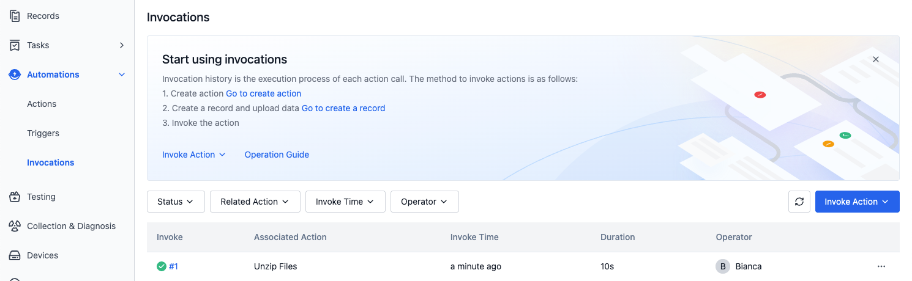
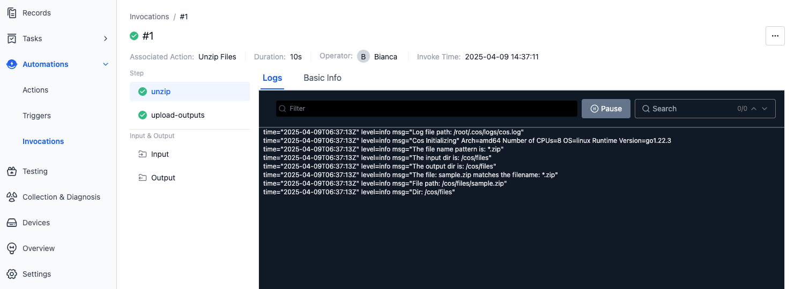
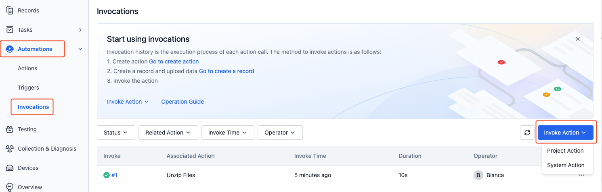
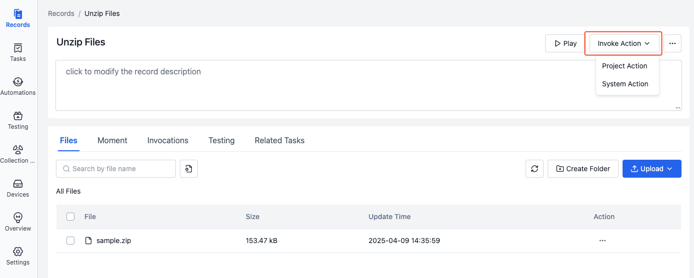
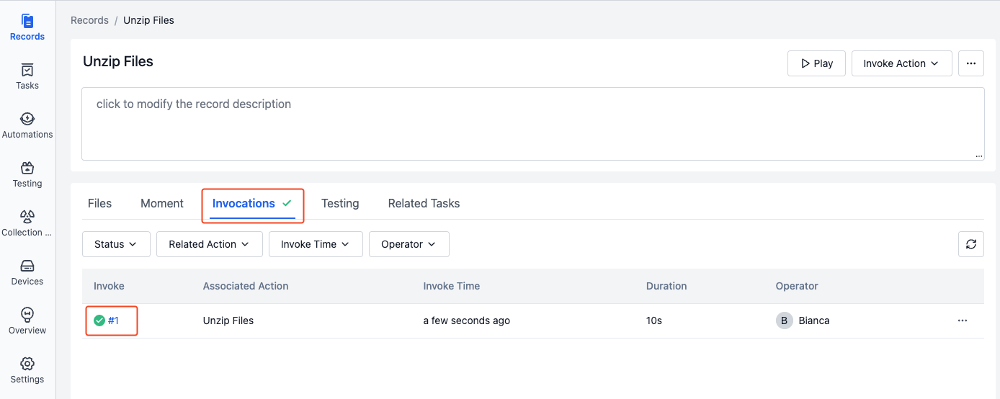
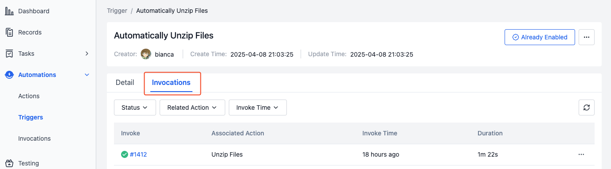

# Invocations
The invocation history displays the execution history of all actions within the project, including information such as time, status, and execution results.

## Invocation Interface
### Invocation List Page

### Invocation Details Page

## Invocation Actions
### Directly Invoke an Action
1. On the "Project - Automations - Invocations" page, click the "Invoke Action" button.

    

2. Select the action to be invoked and the records to be input, then execute the action.

   

3. On the invocation details page, you can view the execution results of the action.

### Invoke an Action in a Record
1. On the "Project - Record Details" page, click the "Invoke Action" button and select the action to be invoked.

   

2. On the invocation history page of the record details, you can view the execution results of the action.

   

### Invoke an Action via a Trigger
1. When the trigger conditions are met, the trigger will automatically execute the corresponding action.
2. On the invocation history page, you can view the execution results of the action.

    