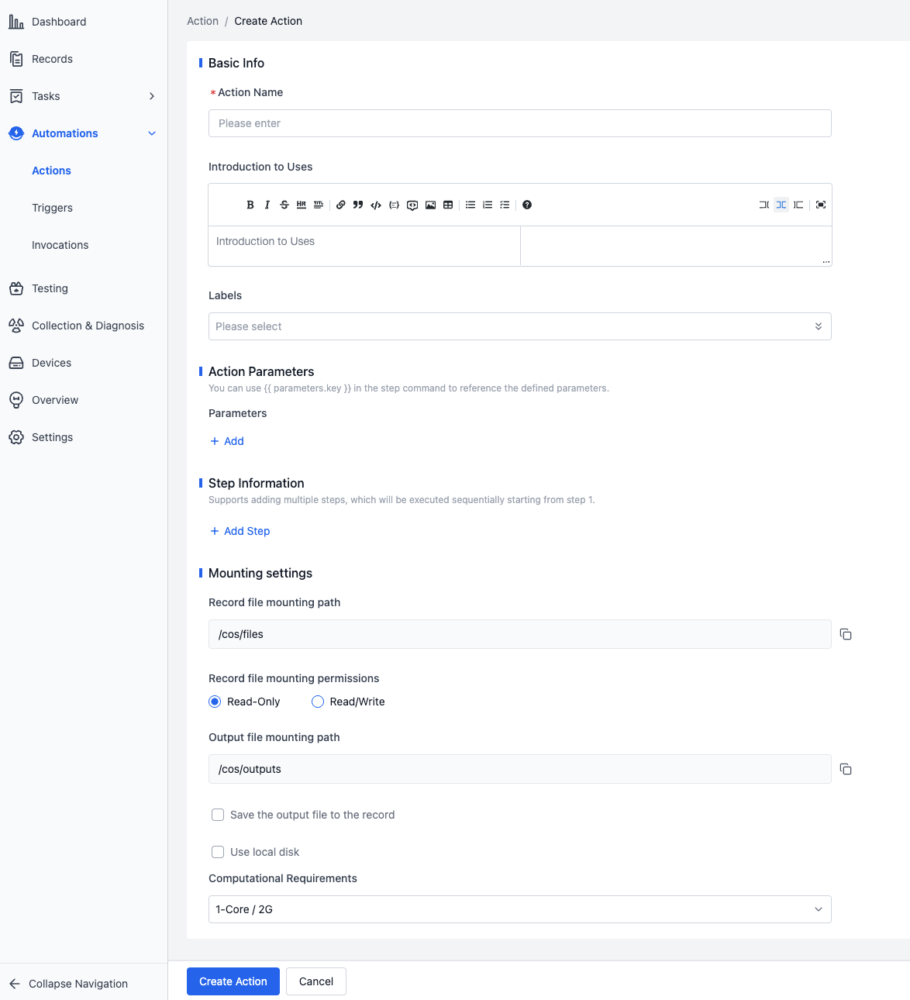
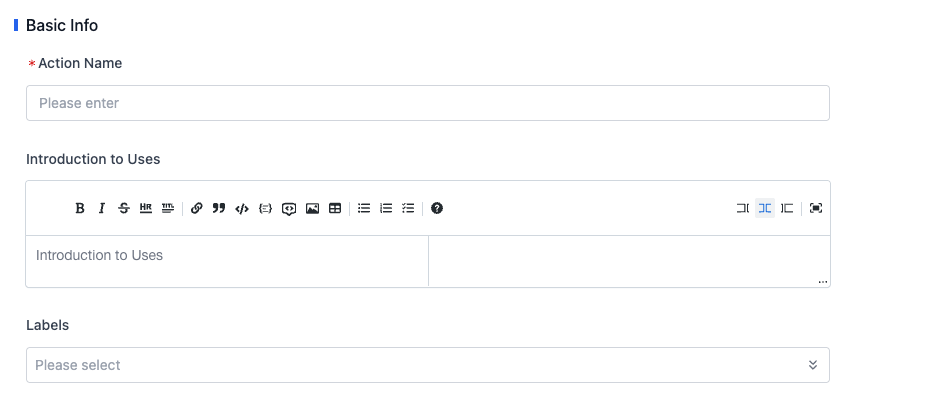
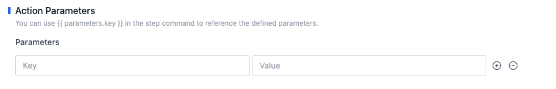
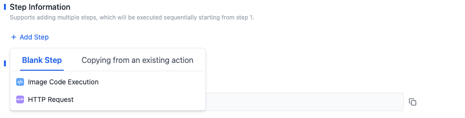
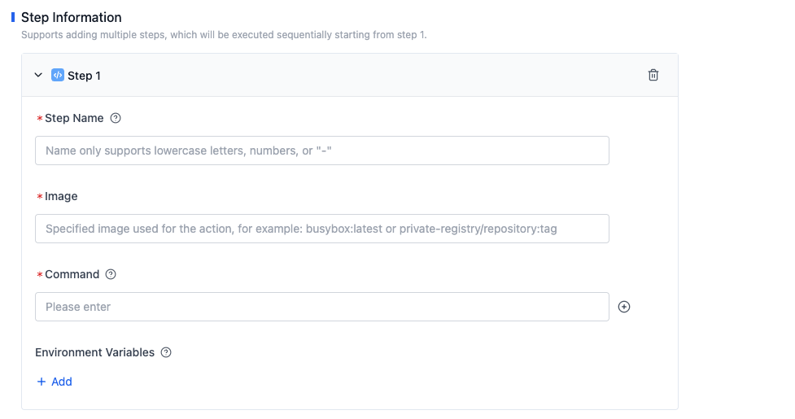
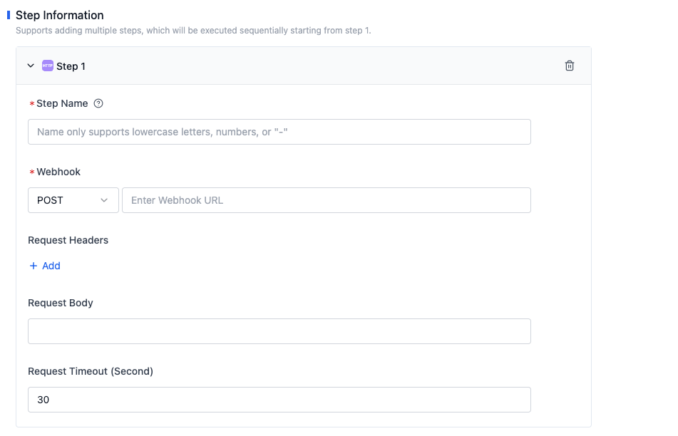
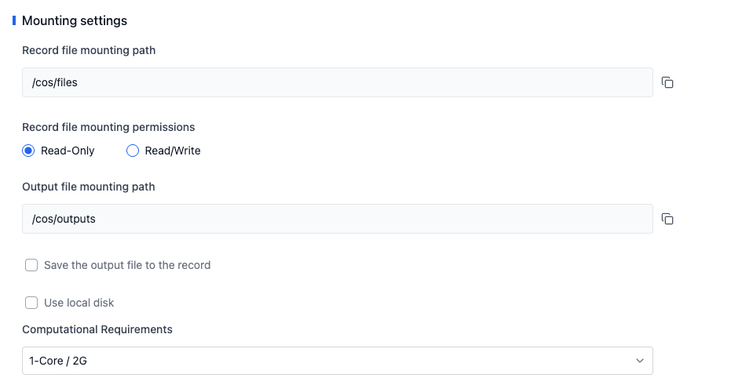

# Building Automation Workflows with Actions

Actions are the fundamental building blocks of automated workflows, representing a specific task. With actions, you can perform a series of data processing operations, including data cleaning, preprocessing, training, and testing. By invoking the corresponding actions on records, you can complete the data processing workflow.



## Basic Information of Actions



- **Action Name**

  Used to identify the specific function or purpose of an action.

- **Introduction**

  Provides a detailed description of the function and usage of an action to help users understand its role.

- **Labels**

  Used to classify or label actions for quick searching and filtering of relevant actions.

## Action Parameters



Parameters consist of a Key and a Value. You can reference parameters in step commands using `{{parameter.key}}`.

For example, if the Key is `input` and the Value is `hello world`, you can reference the parameter in a step command using `{{parameter.input}}`.

## Step Types and Information

An action can have multiple steps. The platform supports two types of steps: Image Code Execution and HTTP Request.

- The "Image Code Execution" step executes custom code logic in a specified image environment.
- The "HTTP Request" step sends an HTTP request to a specified URL and retrieves the response.



### Image Code Execution



- **Step Name**

  Used to identify the specific function of a step.

- **Image**

  The image serves as the execution environment for an action, integrating all the dependencies and tools required to run the action. Currently, the following two image operation methods are supported:
  - **Custom Image**: Upload a custom image to the platform and use the corresponding image address. For detailed operation instructions, please refer to [Images](../../image/1-about-docker-image.md).
  - **Public Image**: Use a publicly accessible image address, such as various open images on Docker Hub.

- **Command**

  Defines the command information to be executed after the image is run. Please modify it according to the actual requirements of your custom image. Note that commands and related parameters should be on separate lines.

  For example, the command `ls -al` needs to be split into two lines as follows:

  ```
  ls
  -al
  ```

- **Environment Variables**

  When running the image code execution step, the platform automatically injects environment variables to facilitate data exchange between the action and the platform.

  Please refer to [Action Runtime Information](./3-action-runtime.md#environment-variables) for more information about environment variables.

### HTTP Request



- **Step Name**

  Used to identify the specific function of a step.

- **Webhook**

  Set the request method and request URL.

- **Request Headers**

  Set the request header information, allowing multiple key-value pairs to be entered.

- **Request Body**

  Set the request body information.

- **Request Timeout**

  Set the request timeout period, with a default of 30 seconds.

## Mounting Settings



- **Record File Mount Path**

  When invoking an action, the system mounts records to the `/cos/files` directory in the image, allowing users to operate on the records within the image.

- **Record File Mount Permissions**

  Define the access permissions of the image to record files. Currently, two types of permissions are supported:
  - **Read-only**: The image can only read record files and cannot modify them.
  - **Read-write**: The image can read and modify record files.

- **Output File Mount Path**

  When invoking an action, you can save the files to be output to the `/cos/outputs` directory, which is the output directory for a single invocation.

- **Save Output Files to Record**

  Define whether to save the files output to the `/cos/outputs` directory to the record.
  - **Add to Original Record**: Upload the files output to the `/cos/outputs` directory to the record. If there are files with the same name, you can choose to overwrite or keep the existing files.
  - **Overwrite Original Record**: Delete the files in the original record and upload the files output to the `/cos/outputs` directory to the record.

- **Use Local Disk**

  The local disk is a local hard drive device on the physical machine where the instance is located, offering the advantages of low latency, high random IOPS, and high throughput. Define the mount path of the local disk, allowing users to operate on the local disk within the image.

- **Computing Requirements**

  Define the computing resource requirements for an action, including CPU and memory. 1 core represents a maximum of 1 virtual core of CPU usage, and 2G represents a maximum of 2GB of memory usage. If the program uses more computing resources than configured, it may be terminated by the system. Please estimate your resource usage and configure reasonable computing requirements.

  The action provides four default configurations: 1 core/2GB, 2 cores/4GB, 4 cores/8GB, and 8 cores/16GB. If you have higher requirements, please contact us.
