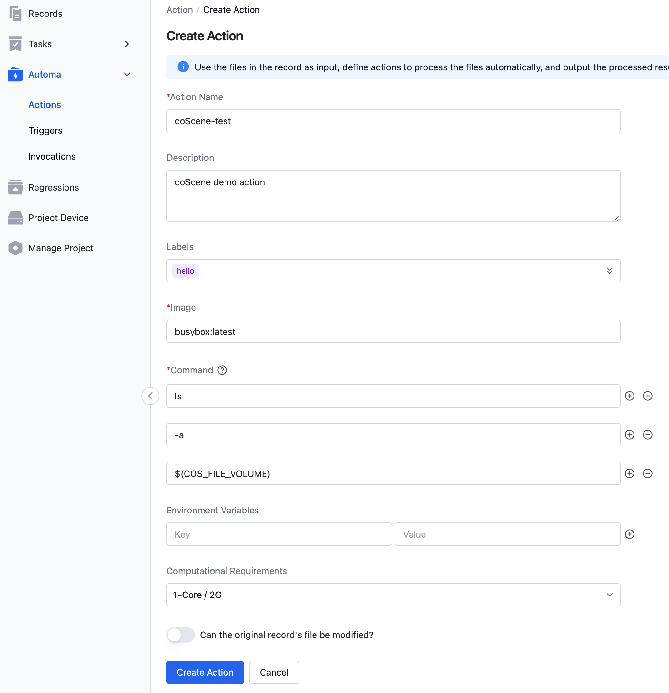
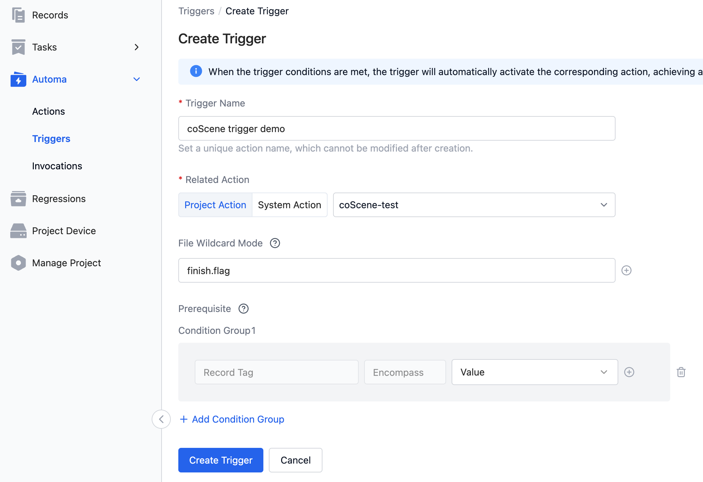

# Learn More About coScene Automation

## Preface

This article introduces the functionalities of the automation module provided by coScene, exploring the concepts and usage of related modules.

## Introduction to Concepts

Automation primarily includes three sub-functional entries: Actions, Triggers, and Invocation History. Triggers are linked to actions; the uploading of files will initiate the operation of triggers. Triggers that meet conditions will activate actions, completing an automation run displayed on the Invocation History page.

### Actions

Define user behavior, referring to the operational logic they wish to execute, mainly consisting of the user's own business code logic. For example, listing all files in a directory (`ls -al`) or running a specific program (`python hello.py`).



#### Action Name

Users should fill in a meaningful name based on the functionality.

#### Description

Provides a detailed introduction to the action's related information, optional to fill.

#### Image

Currently supports two methods of operation:

1. Users can upload a custom image to the coScene platform, then use the corresponding image URL. For more details, see [Pushing Images](https://docs.coscene.cn/docs/recipes/regression/image-management#2-%E6%8E%A8%E9%80%81%E9%95%9C%E5%83%8F)
2. Use a **publicly accessible** image URL, such as various open images on Docker Hub

#### Command

The command information executed after the image runs. Please modify it according to the actual needs of your custom image. **Note that the command and related parameters should be written on separate lines**. For example, the `ls -al` command should be split into two lines:

```
  ls
  -al
```

#### Environment Variables

Users can preset relevant environment variables for the program to use. coScene has predefined some environment variables. When defining, please avoid using these names to prevent unexpected program errors.

- `COS_CODE_VOLUME` - Code mounting directory, value `/cos/codes`
- `COS_BIN_VOLUME` - Binary files mounting directory, value `/cos/bins`
- `COS_BUNDLE_VOLUME` - Test package files mounting directory, value `/cos/bundles`
- `COS_FILE_VOLUME` - Original uploaded data files mounting directory, value `/cos/files`
- `COS_ARTIFACT_VOLUME` - Batch test artifact directory, users can write output during the run for saving, value `/cos/artifacts`
- `COS_OUTPUT_VOLUME` - Output files directory, users can save program output data here, such as bag files. It can be compared and played back with original bag files, specific value `/cos/outputs`

The following environment variable values are optional and consist of uuid-formatted IDs when present, otherwise, they are empty.

- `COS_ORG_ID` - Organization ID
- `COS_USER_ID` - User ID
- `COS_WAREHOUSE_ID` - Warehouse ID
- `COS_PROJECT_ID` - Project ID
- `COS_RECORD_ID` - Record ID

#### Compute Requirements

Limits the maximum CPU and memory usage of the program. 1 core means up to 1 virtual core of CPU can be used, 2G represents a maximum of 2G of memory. Exceeding configured resources might cause the program to be terminated abnormally by the coScene system. Estimate resource use and configure reasonable compute requirements.

Actions offer four default configurations, `1 core/2G`, `2 cores/4G`, `4 cores/8G`, `8 cores/16G`. If higher requirements are needed, please contact the coScene team.

### Triggers

Triggers define the timing of actions. When a new file is successfully uploaded, the trigger checks based on the configuration. File wildcards can limit the name format of uploaded files, and condition groups can restrict the scope of records to which uploaded files belong, such as only allowing records with the `hello` label to trigger an action upon successful file upload.



#### Trigger Name

Fill in a meaningful name based on business needs.

#### Associated Actions

Actions created on the action page are project actions, available for selection. coScene has developed some common system actions based on customer scenarios to reduce development effort, such as automatic diagnostic functions. For related common needs, please contact the coScene team.

#### File Wildcards

Used to match whether uploaded files meet the format definition, determining whether subsequent triggers will activate actions. Refer to the page for specific syntax logic.

#### Conditions

Supports filtering associated record tag information. Only records meeting the tag requirements can satisfy trigger conditions. **Note that changes in record tags will not trigger coScene system verification of related triggers**. For example, adding a new tag to a record will not trigger the trigger to check and then run the corresponding action. _Currently, only file uploads will trigger the operation of triggers._

### Invocation History

Invocation history displays the execution history of all actions within the project. Users can click on a record to view detailed information about a single run, providing an overview of status, time, operating user, etc. It also provides specific execution log information, allowing users to check the running status of programs for easier development and debugging.

#### Invocation History List Page


#### Single Run Detail Page


